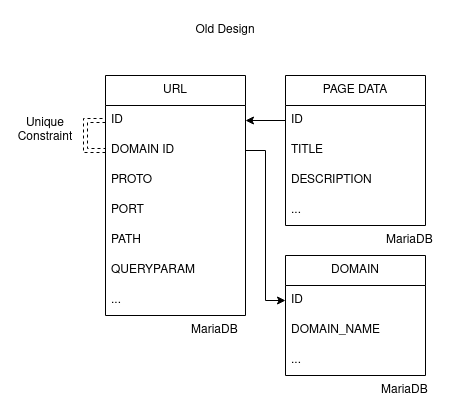
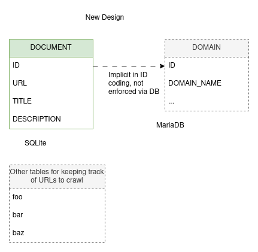
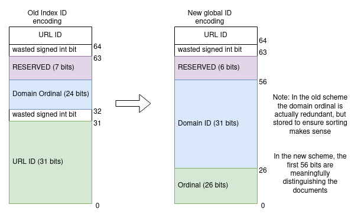
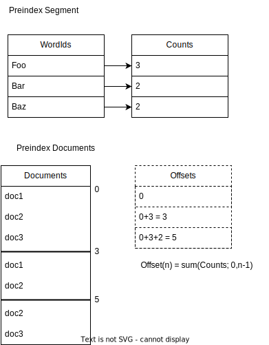
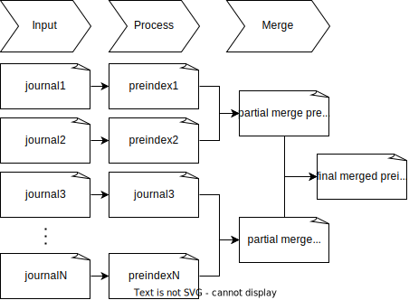
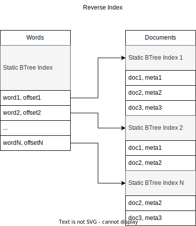

So... I've had the most unreal week of coding.  Zero exaggeration, I've halved the
RAM requirements of the search engine, removed the need to take the system
offline during an upgrade, removed hard limits on how many documents can be indexed,
and quadrupled soft limits on how many keywords can be in the corpus.

It's been a long term goal to keep it possible to run and operate the system 
on low-powered hardware, and so far improvements have been made, to the point
where my 32 Gb RAM developer machine feels spacey rather than cramped, but this
set of changes takes it several notches further. 

But to roll back the tape to more somber times.

Marginalia Search went offline for almost a week due to some problems
with the [latest release](https://www.marginalia.nu/release-notes/v2023-08-0/).  

I won't go into the details too much here, it was a string of fairly trivial 
scaling problems in a process with a run time of 1 day when it works well 
and 2-3 days when it doesn't.  Had to restart it a few times, mostly because
it ran out of RAM.

The cause of the *outage* was the fact that the system needs to go offline 
during an index switch in the first place.  If it could have staid online while
all this went on, nobody would have been the wiser...

The reason for this is that the URL database is wiped during an upgrade.

Inserting and updating rows in a database table rapidly approaching a billion rows 
is *slow*, and the processes involved in loading the new data uses a crap-ton of RAM
and can't co-run with the index service which does the same; and the primary key for
the table is also a 32 bit integer so ...  you can't really go beyond 2 billion in the
first place.

While the processes to get the system up and kicking again were ticking along,
I had a moment to reflect on the problems, came up a plan to slay the dragons
responsible for needing any sort of outage, while at the same time drastically
reducing the system requirements. 

## The First Dragon:  The URL database. 

The URL database is one of the oldest components of the search engine and a
lot of the design decisions that went into it made sense at the time, but that
hasn't been the case for years since.  Everything about the system is alien
to how it looked back when the tables were first drawn up.

Migrating the data has been such a nasty prospect that it's mostly been left to
be as-is modulo some fairly small changes (ALTER TABLE ... takes a few hours in prod).

At the heart of the URL database is two tables that are only ever written to while loading a new
index, and only ever read via primary key lookups.  There's an additional index keeping paths 
unique within domains, and it is just absurdly large for what it does.



There's a URL table mostly responsible for assigning an unique numeric ID to each URL, and a PAGE_DATA table, where each PAGE_DATA entry contains information such as the title and description of a link, if we've indexed it.  

So what if we smack these two tables together into a single table **sqlite database**, 
keep the data real simple, make the loader process responsible for generating unique IDs, 
and have some other table for enumerating URLs we aren't indexing... yeah that's pretty doable.  

It's an unconventional choice to mix sqlite and mariadb like this, but the two serve different needs.
The system needs a persistent view of the world, but that view is relatively small, like sub 1 GB most likely,
but also plug-and-play state changes (with state in the terabytes).  It does fly in the face of every 
conventional wisdom, but has real benefits.

So, something like this:



We're still softly relating the DOCUMENT and DOMAIN tables arcoss databases, but we never actually need to join
the two; in fact in a disaster scenario, the most important bits of the DOMAIN table can be re-constructed from the DOCUMENT table.

I'm glossing over some details...

## Generate unique URL IDs with no index

The URLs table was using 32 bit IDs, and it was always on the brink of integer rollover 
and a known scaling issue.  Part of why the URL database is wiped is to keep the ID 
column from overflowing.

This doesn't really work if we want to generate unique IDs in a way that won't require us 
to keep a collection of each URL we've seen in memory.  URLs are sometimes repeated so we
 can't just use a counter and increment each time. 

Each record also had a DOMAIN ID, but each URL only has a single domain.  In the old solution
there was a unique constraint on URL ID and DOMAIN ID.  That's not really desirable, as indices 
get very expensive for tables this large.

So let's *construct* a 64 bit ID instead of letting the database assign one for us.  Say the lower
26 bits are an ordinal, bits 26-56 are a document ID, and the highest most bits are reserved for the
index to do sorting tricks with.

This permits about 67,000,000 documents per domain (~10x English Wikipedia), and 2 billion domains,
which is nearly 100 times as many domains as the number of domains Marginalia has seen referenced 
anywhere on the web.  Nice and future proof.

We're moving a lot of data sanity responsibility out of the database and into the process that 
generates the data, but they are a lot cheaper to enforce on that end so that's a feature, if a 
bit unconventional.



## Unexpected Benefits

So getting rid of all these humongous indices and large tables mixing hot and cold URL data means
the MariaDB server doesn't need 36 Gb of RAM anymore.  The hot data left in MariaDB is a few hundred
megabyteas at most, and the server most likely won't need more than 2 Gb assigned to it.  

The SQLite data needs an index too, but only for its primary key, and the actual hot part of
the index should be sub-gigabyte. It's this much smaller because we're indexing an order of
magnitude less data, and the index is of a single 64 bit long.  There is no additional unique 
constraint! 

Additionally, since the output from the loader is now just a bunch of files, it turned out to
be pretty easy to create an automatic backup of these files.  That means that in the case of 
a bad deployment, the system can recover from a disaster within a few hours as contrasted with almost 
a week like before.

If I had stopped there, it would be a pretty sweet change, but I felt emboldened by the success
and decided to turn to the other piece of ancient technical debt. 

## The Second Dragon:  Reverse index construction

The previous changes mostly affected the loader.  It outputs a urls database and a (document,words[])-oriented
journal of document data.  We need to transpose that data into something that is not only on the shape (word,documents[]),
but then make it indexable.

To help do this, a lexicon is used to map from keyword strings to a dense mapping of term ids.  The first word you insert 
gets id 0, the next word id 1, etc.  This is basically a long->int open hash map.  The system maps from string to long using
a 64 bit hash function.

The problem with this is that it gets full.  This is mostly a Java problem, since Java doesn't permit arrays with more than 2 
billion entries; and the implementation used chokes all the way back at 1 billion.  You can work around it, but even if you do,
the next problem is that at 1 billion entries, it uses 12 Gb of RAM. 

The index service sits at a well-endowed 60 Gb RAM in production right now, most of which is off-heap memory so it could do with
going on a bit of a diet.  It's on-heap (i.e. within-JVM) size somewhat exceeds 32 Gb wich is especially unfortunate, as it prevents 
the use of [CompressedOOPs](https://wiki.openjdk.org/display/HotSpot/CompressedOops), which is something you really want in Java.

The old reverse index construction has, like the URLs table, been around for a hot minute.  It's mostly been around due to how 
unpleasant it is to work with.  I was really struggling to find a good abstraction while I originally built it, and it's been
*append only code* since.  It's not made better by this inherently being very finicky programming.  If anything is even the slightest
bit off, everything falls apart in deeply inscrutable ways. 

Very loosely, the shape of the algorithm was something like this:

```java
  highestWordId = findHighestWordId();
  long[] counts = new long[highestWordId];
  for each word in each document:
    counts[word]++;
  
  // offsets[i] = sum(counts, 0, i);
  long[] offsets = turnCountsToOffsets(counts); 
  write offsets to file
  
  long[] documents = memory map max(offsets) longs in a file
  
  for each word in each document:
    documents[offsets[word]++] = document
  
  // draw the rest of the owl
  constructIndices(documents, offsetsfile)
```

We need a lexicon because of this part.  We're relying on the domain of word ids to be densely packed.

```java
  long[] counts = new long[highestWordId];
```

Other than requiring an absurd amount of RAM, there's a subtle farther down in the code:

```java
  for each word in each document:
    documents[offsets[word]++] = document
```

This part writes about a terabyte of data out of order to a memory mapped file.   Since it is almost completely
out of order, most of these changes are constantly being committed to disk. You may have heard
that SSDs deal with random access much better than mechanical hard drives.  For read access this is largely
true, for small writes it is not, due to an effect called [write amplification](https://en.wikipedia.org/wiki/Write_amplification).  

In brief, every time an SSD updates a single byte anywhere on disk, it needs to erase and 
re-write that entire page.  To avoid this it has caches that gather adjacent writes into a single operation,
but these caches aren't terabyte sized, and do nothing in this scenario.

So while we're writing a terabyte, the hard drive is writing  something like half a petabyte. This is understandably slow and puts an insane amount of wear on the disk.

For a long time a stopgap has been in placed called a `RandomWriteFunnel`, which buckets the writes
into smaller files first, and then writes the larger file in-order.  This is very slow, but not
as slow as spraying and praying like the original algorithm did.

I've understood for a long time that this is not the civilized way of transposing index data.  What you do instead is 
to create a series of smaller indexes where everything fits in memory, and then you merge them.  Merging sorted lists
is fast and even mechanical hard drives agree with the operation.  Still a bit finicky though, especially since we'll
merge sorted lists of sorted lists that need merging.  

If you construct the index this way, you **no longer need the lexicon**!  It's possible to use the 64 bit string hashes 
for term ids instead!

Initially a few head-scratchers cropped up:

* The input to the index construction is compressed.  How can parts of it be read quickly?  --- Don't.  Create multiple smaller files instead, and read them one by one.

* What is a good way to merge indexes? ---  Don't.  Merge the data before the indexes are created.

An abstraction called a `preindex` is introduced, which is basically what was constructed in the 
code sample above.  Two arrays, one with wordIds, and one with counts; both indexing a third array
with document data.

* [index-reverse/.../ReversePreindex](https://github.com/MarginaliaSearch/MarginaliaSearch/blob/master/code/features-index/index-reverse/src/main/java/nu/marginalia/index/construction/ReversePreindex.java)
* [index-reverse/.../ReversePreindexDocuments](https://github.com/MarginaliaSearch/MarginaliaSearch/blob/master/code/features-index/index-reverse/src/main/java/nu/marginalia/index/construction/ReversePreindexDocuments.java)
* [index-reverse/.../ReversePreindexWordSegments](https://github.com/MarginaliaSearch/MarginaliaSearch/blob/master/code/features-index/index-reverse/src/main/java/nu/marginalia/index/construction/ReversePreindexWordSegments.java)



Since the inputs are small, these preindexes are easy to construct as we can do most of it in RAM.  It's so much easier when you can do you can assume the data fits in RAM.  We can then commit them to disk as we generate them, and add a subsequent merging step to construct one final preindex.



The preindex is finally turned into the reverse index by adding static btree indices to the words 
table and each document block like before.  This is a relatively quick process.



This does not only require much less RAM since the lexicon is out, it's also quite a bit 
faster than the original algorithm.  But wait, there's more!  The lexicon had the unfortunate
side-effect of giving each set of processed data its own dialect, a word might be given one ID
in one run, but probably another ID in another run.  This meant that you needed to process all data
at the same time.  Foregoing the lexicon, it's possible to merge disparate sets of data, and e.g.
reuse the output of processing a large set of seldom-changing data (say Wikipedia), and join it with
more frequently changing index data. 

## In closing

This set of changes has been absurdly successful.  The system RAM requirement has been halved,
almost every single known scaling problem and operational paper cut has been addressed. It's also
had unexpected benefits I've only begun to consider.

I wish I knew what happened, or how to replicate it.  It's involved more upfront design than I 
normally do, by necessity.  I like feeling my way forward in general, but there are problems where
the approach just doesn't work.  This is squarely within that domain.

Sometimes you just tug at the right yarn I guess, and then problems unravel one by one. 
