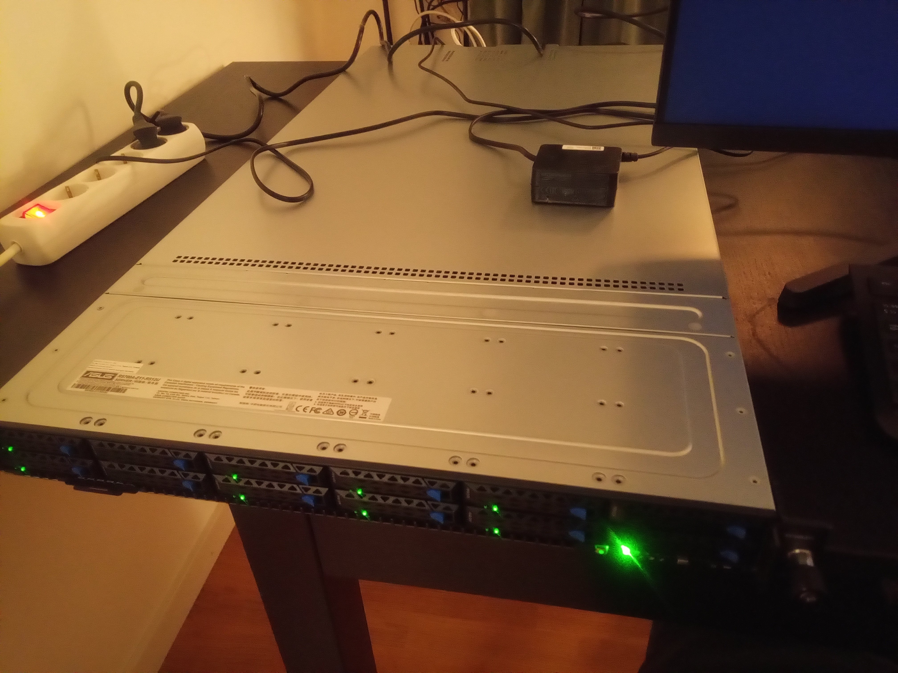
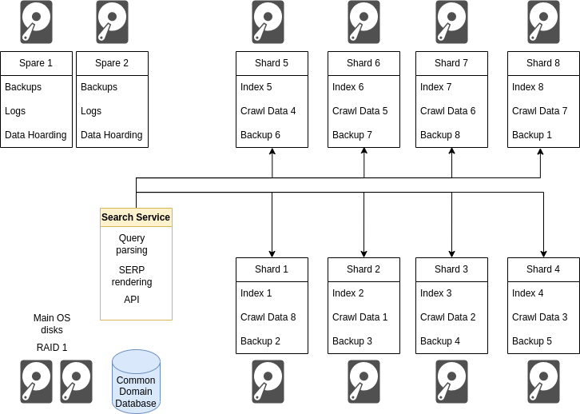

So the search engine is moving to  a new server soon, thanks to the generous grant 
[mentioned recently](https://www.marginalia.nu/log/88-futo-grant/).

If you're using it now, it may or may not use the old or new server.  It'll be like this for
a while, since I need them both for testing and maintenance type work. 

This project seems to generate a lot of goodwill from the technologically inclined,
so when I went to order the server, they sent me an email stating they liked what I was
doing and offered a free CPU upgrade. From dual Epyc 7443 to 7543. Thanks [Mullet 
Scandinavia!](https://mullet.se/) (Swedish website).  



So the server's a big beefy one. The machine has 512 GB of RAM and 10x8 plus 2x4 TB SSDs, 
and the aforementioned dual Epyc 7543s for a whopping 128 logical cores.

Some decisions needed to be made about how to deploy the search engine 
onto the server.  The software will need some modifications to make 
good use of the hardware, but that's a later worry. 

## OS Setup

We're going Debian Bookworm.

The idea has always been to skip RAID for the index drives and run multiple index
partitions on at least 8 of the 8 TB drives, keeping the other two for spare storage 
space, testing, and ready to be wiped and repurposed with short notice.  

If a drive croaks, 12.5% of the index needs to be reconstructed on one of the 
two spare drives, which would be an inconvenience and a temporary loss of capacity 
but it's not catastrophic end of the world type stuff.

Since most of what search engines do is embarassingly parallel along 
the axis of domains, this basic design makes sense.  The machine has 
64 physical cores and a bunch of disks, so we want to put them all to 
work where possible.

Keeping each shard on a different physical disk by design reduces 
resource contention, which is desirable since the expected access 
pattern will be a shotgun blast of requests hitting each partition 
at the exact same time, triggering an intense flurry of reads.

## Page Faults

There are still lingering concerns with this approach.  The software
is based around memory mapped storage, and Linux' page fault handler 
can only put up with so many page faults at any given time.

A potential way around this is virtualization, to run multiple operating 
systems on the same machine. 

There are clear drawbacks with this. Each operating system essentially gets 
a fixed allocation of RAM, something like 32-48 GB.  This can lead to quite a lot of 
wasted resources, VM #3 may really need 64 GB instead of 48 GB at a point 
where VM #4 may have 24 GB to spare.  The single-machine paradigm will permit
large processing jobs to borrow small amounts of RAM from each partition without
disruption.

I think the drawbacks of virtualization outweigh the benefits here.  It's probably
easier to re-code the index to reduce the amount of page faults if necessary than to reclaim the
wasted RAM and resources.  It's also very hard to backpedal on a setup 
like this, it would essentially entail wiping the entire server and rebulding it 
from scratch, storing dozens of terabytes of crawl data god knows where in the 
meantime.

A core value for the project is to make the best use of the hardware available.  Much
of what you'd consider conventional wisdom in this field is based around the assumption
of hardware being cheap, and development being expensive.  In this project, it is the other
way around, even now with a server 10X as powerful as the previous one.

## Resilience and recovery

Having more important hard drives increases the odds of disk failure in the same way throwing
more dice increases the chance of rolling a 1.  Disk failure needs to be considered
a real possibility and factored into the design.

There are two failure modes. 

### Single Disk Error

One of the two OS disks can fail without any interruption to operations, thanks to RAID1.

In the scenario where one of the index disks were to fail, the capacity of the 
system will drop by 12.5% for about a day.  At this point one of the two spare drives 
will be repurposed into a new index disk.  This capacity drop is a tolerable inconvenience.

### Disaster

In the case of a more unlikely scenario, with multiple simultaneous failure of several drives, the system is designed to be *eventually* recoverable from just scraps of the data.  With the design proposed, you'd need simultaneous failure of seven hard different drives to put a permanent end to operations. 

* You can regenerate the crawl data from the domain database (RAID 1).
* You can regenerate the index from crawl data.  
* You can regenerate the domain database from crawl data.  
* You can regenerate the index from index backups.  
* You can regenerate the domain database from database backups (2 physical disks, also hot spare).

Some of this is accomplished by using a daisy-chained data layout where disk N carries the Nth index, crawl data for shard (N-1), and index-backups for shard (N+1).  Thus to eradicate all knowledge of shard 3, disks 2, 3 and 4 would need to die along with both the backup disks and both the main OS disks. 



## Daisy, daisy...

This design has every potential to become difficult to reason about without careful thought being put into the execution.  

The sane way of accomplishing this disk assignment scheme is to have one directory of mounted disk partitions, and to use a parallel tree of symlinks to accomplish the distribution, and then have the code only interact with the symlinks while the operating system deals with the rest.

Like so:

```
/app/index/1/backup  ->   /disk/2/backup
/app/index/1/current ->   /disk/1/current
/app/index/1/storage ->   /disk/0/storage
/app/index/1/work    ->   /disk/1/work

/app/index/2/backup  ->   /disk/3/backup
/app/index/2/current ->   /disk/2/current
/app/index/2/storage ->   /disk/1/storage
/app/index/2/work    ->   /disk/2/work

...
```

## Software

Finally, a note about adapting the software.  The first stage migration will just
run the existing code on a single partition, but moving forward, the aim is to make
modifications to be able to have multiple backing indexes.  

Since one of the objectives of the project paradoxically is to build search engine software
that doesn't require an insane monster of a server like this, this also makes sense, since
it keeps the indexes "PC sized" and might permit a cluster-based solution elsewhere.

There are other dev-ex benefits to keeping the working data sets small as well, it's just less of
a pain to work with 100 GB files than 40 TB ones... 

...

This is all written sort of mid-configuration.  Nothing is quite final. A copy of the search engine 
is up on the new server, but it's all a bit of a construction space right now.  It's really great to 
have to servers though, since the old one is still around, if I need some downtime, I can just re-direct 
the DNS to the old IP.


