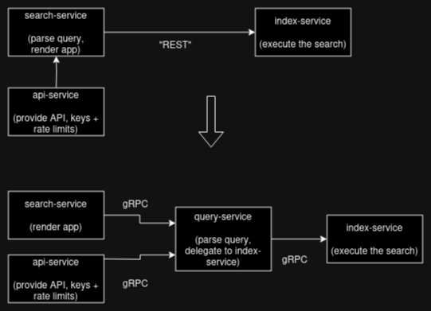
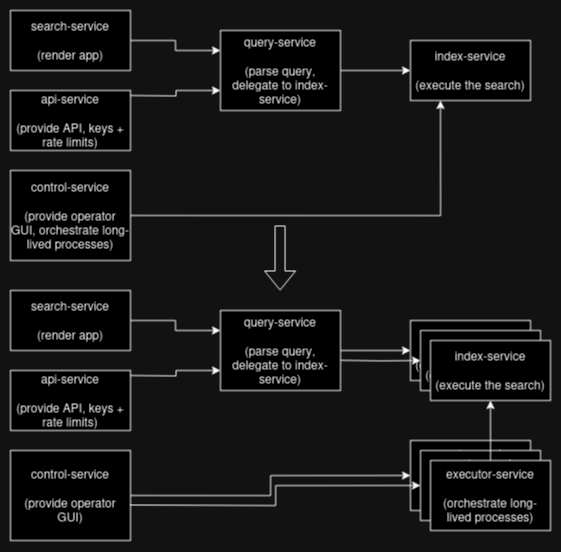
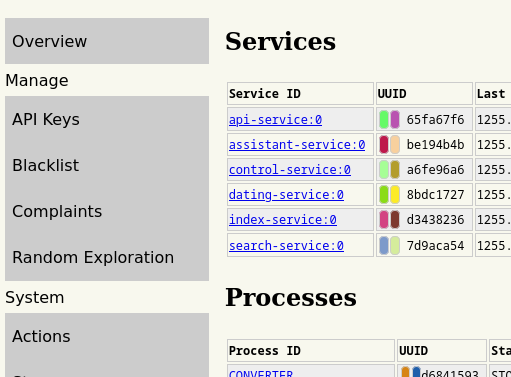
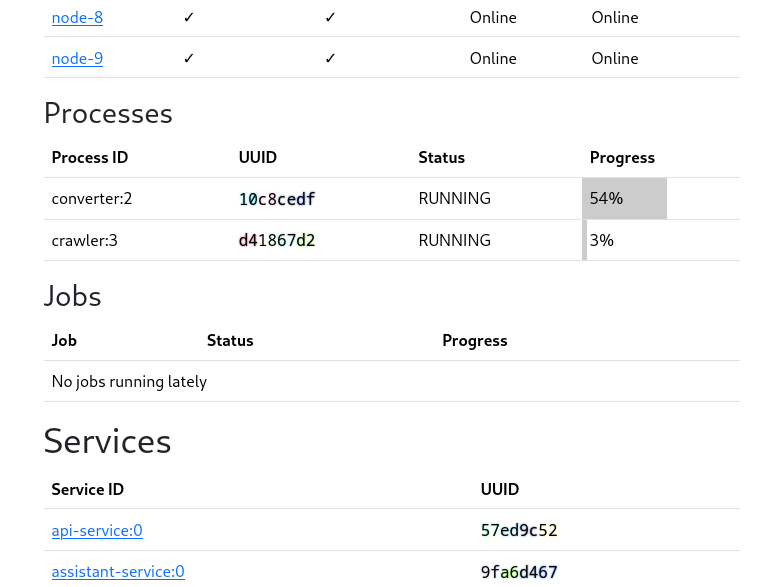
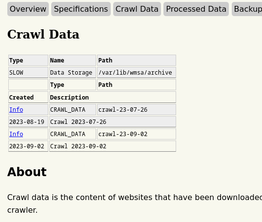
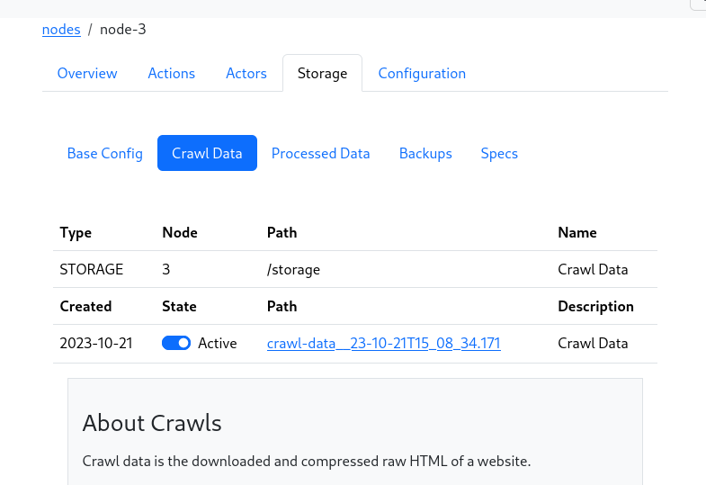
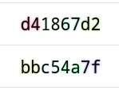

So a bit of an update on what I've been working on.  This will be adapted into release notes in
a while, but I haven't quite wrapped a bow on the change set yet.  

Still, it has certainly been a few weeks. Didn't quite land how busy I've been until I set down to 
draft this post.  Them's some changes, and I'm skipping a few to keep this meandering post at a sane length.

In very broad strokes, are a few problems I'm working on in parallel:

* The search engine has had a lot of downtime and outages due to upgrades in the past.  Most of that is [fixed now](/log/87_absurd_success/),
but there are still a few chafing points that need to be sanded down.
* The project was given a generous grant, which led to [a huge hardware upgrade](/log/90-new-server-design/).  The software needs to be adapted
to make use of the hardware. 
* The current goal is to just get to 1 billion documents in the index. We're at 170 million now.  

## Query Service

The first change was to introduce a new service in between the `search-service` and the `index-service`, called the `query-service`. 

The search-service is responsible for the application side of Marginalia Search, what you see when you visit `search.marginalia.nu`.  

It *was* also responsible for query parsing, which meant the API gateway ended up having to talk to the front-end to offer search 
capabilities over REST/JSON.  This is a bit of a convoluted layout, and since this is after all an open source project, it would 
be desirable to be able to white-label the search engine back-end and not have to run a bunch of vestigial Marginalia Search stuff.

The query-service takes ownership of query parsing, letting the `search-service` and `api-service` just be dumb gateways.



I had anticipated this would be a lot of work but it turned out to be a fairly quick job. 

When testing these changes, I wasn't quite happy with the response times, which were in the 180-200ms range.  Not what I'd
expect.  Looking into how long the actual query execution took, that was actually a more reasonable 50-80ms.  Over half the 
response time was in doing other stuff..?

The entire project, before it was a search engine, started out as a middleware experiment cobbled together from a bunch of stuff that don't really
make sense.  This evolved into a sort of personal microservice mesh offering a bunch of disjointed services that were nice to have, from
pulling weather forecasts to aggregating my favorite podcasts.  Vestiges of this history has still lingered deep in the bowels of the client layer, 
which provided basic REST calls, using a very liberal definition of REST.  

Since both the internal requests and and responses are very large, I had a hunch RPC and serialization may be part of what was eating the response 
times.  So I ported the API to gRPC, and response times dropped to more manageable levels.  There's more to do here, but I'm happy taking
the performance boost today and taking the old client library out behind the barn another day.  This change set is already sprawling enough as 
it is.

## Partitioned Index

It's desirable to be able to run multiple index partitions.  Given the hardware I have it would be possible to run one single humongous instance,
but it would have very long start-up times, and in general, I think it's easier to find multiple machines with ~64 GB RAM than a single server with
512 GB RAM...  

Even though it's very fashionable, in general I'd advise against building distributed software if you can avoid it as it comes with a significant 
share of hassles and downsides,  but I don't think I can get away with avoiding it here. Vertical scaling will only go so far, and the ambitions for
Marginalia Search reach farther still.

Most of the machine configuration aspects of this was covered in the [previous post](/log/90-new-server-design/), this is mainly regarding the software
changes.  Actually partitioning the index itself is very easy and straightforward.  The problem is embarrassingly parallel almost through and through, so
while this looks like an enormous change, in practice it just isn't.  



The problems are far more practical.  First, given the just north of 1 TB worth of crawl data was migrated off a single-partition system, how to redistribute that 
across 8 partitions? I wrote a redistributor that was a bit of a one-off job for accomplishing exactly that.  Some hiccups along the way mostly to do with
sending lots of data over channels not designed for that, this is fairly straightforward.

Next, given the system now consists of 7 services across a total of nearly 30 instances, how do you even manage that while retaining some sense of sanity? 
The answer is mostly alerts and automation, and there are thankfully many tools for that sort of thing.  This is a of ongoing work, but as a sketch:

* The system now runs on docker-compose, and a lot of the routing is done via trafeik. 
* To keep myself sane I set up a minimal continuous integration and deployment pipeline.
* Logging is still just a bunch of files.  The production system doesn't actually log all that much though because search traffic has all kind of sensitive information.
* ... your usual prometheus metrics and dashboards.

(I don't use Kubernetes because I find it too janky.  I will only tolerate that degree of jank from software I've built myself, because then at least I can reason
about it ;-) )

Finally, configuring the thing... Finding sane configuration abstractions is difficult at the best of times. Finding ones that make sense for distributed software
is harder still, especially given the software also needs to make sense with a single partition...

The upside is that this gave me a well needed kick in the butt to re-visit the control GUI.

## Control GUI: Take II

The control GUI I put together a while back didn't really cut it.  I left it as it was knowing it had a lot of paper cuts, with the intention of cleaning it up later when
I had used it for a while and gotten a feeling for just what chafes.  Well, yesterday's later became today, as the GUI now also needs to be able to manage a more complex software
system with multiple partitions.  I migrated it to bootstrap since it has much better form controls and it takes care of a lot of stuff by default that 
would otherwise be time consuming.

Process monitoring:





Storage management:





There's still polish that is missing here and there, but I can only deal with so much front-end development in one go without breaking out in hives.
Building user interfaces is very time-consuming.

The reason the truncated UUIDs are so colorful is that I have mild dyslexia and struggle differentiating large numbers, and I'm using color highlights to help 
make that easier.  Keen eyed readers will no doubt have already gleaned the dyslexia part from the sheer number of weird typos that adorn my updates.



## Actors: Take II

To keep track of processes that are long-running and manage state that is system wide and needs to survive crashes and so on, a database mediated actor framework
is used.  This is fairly slow and clunky, but does a good enough job.  The way I implemented this using reflections and annotations turned out to be very annoying
and error prone.  The logic became spread out and very difficult to follow.

I re-implemented this using Java's new record pattern matching switches.  This has a lot of benefits.  It keeps the logic in one place, and type safety helps weed
out a lot of the problems with the first iteration that ended up using strings for control flow in many places, and had weird possibilities like jumping to states 
that don't exist.  Much of this is prevented by the compiler now.

```java
    // OLD STYLE:

    @ActorState(name = "INITIAL", next="GREET")
    public void initial() {
        return "World"; // passed to the next state
    }
    @ActorState(name = "GREET", next="COUNT-TO-FIVE")
    public void greet(String name) {
        System.out.println("Hello " + name);
    }
    @ActorState(name = "COUNT-TO-FIVE", next="END")
    public void countToFive(Integer value) {
        if (null == value) {
            transition("COUNT-TO-FIVE", 0);
        }
        System.out.println(++value);
        if (value < 5) {
            transition("COUNT-TO-FIVE", value);
        }
        if (value > 5) {
            error("Illegal value");
        }
        // Default transition is to END
    }
    @ActorState(name="END")
    public void end() {
        System.out.println("Done");
    }

    // NEW STYLE:

    public record Initial() implements ActorStep {}
    public record Greet(String message) implements ActorStep {}
    public record CountDown(int from) implements ActorStep {}

    @Override
    public ActorStep transition(ActorStep self) {
        return switch (self) {
            case Initial i -> new Greet("World");
            case Greet(String name) -> {
                System.out.println("Hello " + name + "!");
                yield new CountToFive(0);
            }
            case CountToFive(int from) -> {
                int next = from + 1;
                System.out.println(next);
                if (next < 5) {
                    yield new CountToFive(next);
                }
                yield new End();
            }
            default -> new Error();
        };
    }
```

It would have been possible to further limit the amount of hypothetical 
bugs by using a sealed interface here but the juice doesn't at this point
seem worth the squeeze.

## Do as I say, not as I do

So most of this is just one [pull request](https://github.com/MarginaliaSearch/MarginaliaSearch/pull/55) 
that kind of snowballed, and by necessity ended up as a temporary ersatz main branch as various other 
changes needed to be made and the branch and master had diverged too much to keep working on master...


I've been off on this branch for three weeks, and nearly been done for at least two of those weeks...

While the code hasn't been merged down to master, the production system runs on the branch code. 
The production system runs on 9 nodes now; 8 for crawled data and one for sideloaded stuff like wikipedia.  

The server is so powerful I decided to disable Cloudflare.  I can just tank the bot traffic.  I can't 
justify the privacy implications of Cloudflare while having the server power to go without it.  

Benchmarked it and it seems to tolerate around 50-100 queries per second without keeling over, at least
at the current index size.  Not bad.