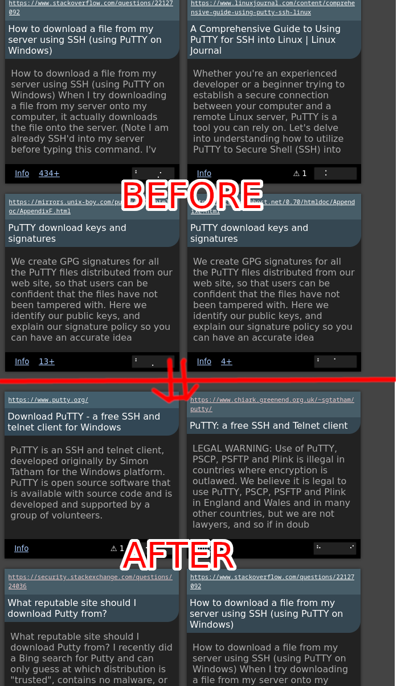

I've been working on getting anchor tag keywords into the search engine,
basically using link texts to complement the keywords on a webpage.

The problem I'm attempting to address is that many websites don't really describe
themselves particularly well.  As Steve Ballmer's stage performance once illustrated, 
merely repeating a word doesn't on its own make what you're saying relevant to the term. 

Another good example of how it falls short is [PuTTY's website](https://www.chiark.greenend.org.uk/~sgtatham/putty/),
which will be used as a pilot case to improve.

It doesn't really say things such as "download putty" or "putty website" with any particular
frequency, and going by keywords alone it ends up fairly low in the rankings.  

Trimming down the blurb of debug information that is output as a HTML comment adjacent to each
search result, we find this next to the putty webpage for the search 'download putty':

```
keyword=download_putty, positions=[⠀⠀⠀⠀⡠⠀⠀], flags=[TfIdfHigh]
keyword=download, 	positions=[⠒⠀⠀⠀⡣⠀⠀], flags=[TfIdfHigh]
keyword=putty,		positions=[⡓⠠⡄⠀⡠⠀⠀], flags=[Title, Subjects, TfIdfHigh, NamesWords, UrlPath, UrlDomain]]
```

Output is abbreviated for the reader's comprehension.  We can see that the keyword "putty" lights up very strongly,
but "download_putty" and "download" are much weaker. (UrlDomain appears because of an encoding bug that 
caused aliasing between Title and UrlDomain)

There's reason to expect there's a great abundance of links to this website with those types of keywords. 
In general we often describe the things we link to.

This is a well understood technique that has been used by search engines
for quite some while, but it's a bit finnicky and Marginalia Search has only
sometimes, through great acts of hackery, used this supplemental source 
of keywords.  

But it's time to support them properly!

There are a few problems.  The first and biggest is logistical.  There are a 
lot of hyperlinks on the internet, and going through website by website, you
get them in an order that is less than optimal.

## Initial Munging

I'm limiting the consideration to external links, that is links to other 
websites.  But even so, after basic deduplication, there are about 600 million 
of them in the current crawl data.  So we need to take these links, out of order, 
and re-order them in a way where they're arranged in order of where they link to, 
not where they link from.

The source data is on this order: 

SOURCE|DEST|KEYWORDS
---|---|---
www&period;marginalia&period;nu|search.marginalia&period;nu/about|"marginalia"
www&period;marginalia&period;nu|wiby&period;me/|"search engine"
www&period;marginalia&period;nu|www&period;kagi&period;com/index.html|"kagi"
wiby&period;me|search.marginalia&period;nu/about|"marginalia"
www&period;kagi&period;com|wiby&period;me/|"cool search engine"

which might as well be randomized. It would be much more useful if reordered,
perhaps something like this?

DEST|KEYWORDS|SOURCE
---|---|---
search&period;marginalia&period;nu/about|"marginalia"|www&period;marginalia&period;nu
search&period;marginalia&period;nu/about|"marginalia"|wiby&period;me
wiby&period;me/|"search engine"|www&period;marginalia&period;nu
wiby&period;me/|"cool search engine"|www&period;kagi&period;com
www&period;kagi&period;com/index.html|"kagi"|www&period;marginalia&period;nu

We're interested in which keywords are present for each link target,
rather than which destination is present in each source. The origin of 
the link is also potentially interesting so we keep it around for future use.

I want to reiterate that the input is very large.  It has duplicate rows which we 
also want to remove at this step.  This helps cut it down in size fairly significantly, 
and the end result is about 16 GB uncompressed.

The by simplest solution is to cleverly choose the colunn order, write the columns in
such order in a CSV file and sort it using command line `sort -u`. 

This sounds like a joke but `sort` is an absurd beast and will sort almost anything 
quickly and efficiently, falling back to a disk based merge sort if it doesn't fit in RAM. 
Only caveat being to remember to set LC_ALL=c to get a lexicographical sort order and not 
whatever locale dependent sort order it selects otherwise.  

Having the data re-sorted, it's now a bit more manageable, and small enough to be used 
and distributed.  We'll munge the data some more later, but this is a very good start.

## Stop Words

The next problem is that while a lot of links have useful descriptive texts, many others have labels
like "click here", or "this article".  The extraction code already filters out the more obvious ones of these,
but there are more.  

DuckDB is great for wrangling data, so that's where we'll go next:

```sql
copy (
	select 
		count(*) as cnt, 
		count(distinct(split_part(url,'/',1))) as distinctDomains,
		lower(text) as lc_text
	from read_csv('atags-sorted-all.csv', 
		columns={'url': 'VARCHAR',
			 	 'text': 'VARCHAR',
				 'source': 'VARCHAR'
				}) 
	group by lc_text
	having cnt>10000 and distinctDomains > 1000
	order by cnt desc 
)
to 'common_words.csv' with (header 0, delimiter ',')
```

We need to be a bit careful, because some anchor texs are very common indeed but unique to a specific website.
This includes both short ones like 'arxiv' but also longer ones that appear only on e.g. bandcamp or tumblr.
We'll deal with repetitive and spammy websites later, so to keep the cognitive load at a manageable level, we're
excluding keywords based on not only their frequency, but how many destination domains they appear in, `distinctDomains`.

The query gives a csv file, [common_words.csv](common_words.csv), with stop word candidates; starting with

count|distinctDomains|text
---|---|---
990672|4892|[-]
768997|3778|facebook
552571|396981|website
409027|3900|twitter
334380|100490|link
331239|25266|download
255519|1743|instagram
237337|58091|read more
233006|172446|visit website
205686|1647|amazon
186496|1879|youtube
171944|47554|source
170935|1106|linkedin
166254|19634|pdf
157340|72777|learn more
121808|18090|go to album
117550|10340|video
...|...

After a manual review, here is a stopwords list for the most frequently irrelevant link texts: [stopwords.txt](stopwords.txt).
We'll leave it like this but may need to do more thorough analysis later.  Attempting to preempt issues that we don't know for sure
are issues yet is a leading cause of foot holes.

## More Munging 

CSV is great for portability, but it has severe limitations when it comes to accessing the data in a performant manner.  This is because
you need to scan forward to find the end of a CSV column and row, so your only way of searching in a CSV file is either to load it into memory, 
or do a linear search, and given that after deduplication we're still at over 13 GB of data, neither is appealing.

Parquet is a good option since it has nested types and a bunch of clever optimizations.  We can have one record per destination domain, 
with list fields containing all the urls, sources and link texts. For csv->parquet conversion, DuckDB springs to the rescue again:

```sql
copy (
	select
		split_part(url,'/',1) as dest, 
		list(url) as url, 
		list(lower(text)) as text, 
		list(source) as source 
		from read_csv('atags-sorted-all.csv',  
		columns={'url': 'VARCHAR',
			 	 'text': 'VARCHAR',
				 'source': 'VARCHAR'
				}) 
		group by dest
) 
to 'atags.parquet' (
	format 'parquet', 
	compression 'ZSTD'
);
```

At this point we can take a moment ot verify that we are on the right track.  Given our hypotheses that 

* this will help provide keywords in the PuTTY scenario described in the beginning of the post.
* parquet will let us query this data quickly.

... we should be able to quickly extract relevant keywords for the putty website:

```sql
select 
	text,
	count(*) as cnt 
from (
	select 
		unnest(url) as url, 
		unnest(text) as text
	from 'atags.parquet' 
	where dest='www.chiark.greenend.org.uk'
) 
where text like '%putty%' 
and url like '%~sgtatham%' 
group by text 
having cnt>1
order by cnt desc
```

A few hundred millseconds later, both hypotheses are reinforced!

text|cnt
---|---
putty                                 |   783 
the primary putty web site            |    21 
download putty                        |    17 
putty download page                   |    16 
putty web site                        |    12 
putty.exe                             |    11 
puttygen                              |    10 
putty website                         |     9 
putty ssh client                      |     7 
download and install putty            |     6 
putty: a free telnet/ssh client       |     6 
putty: a free win32 telnet/ssh client |     5 
putty documentation                   |     5 
...|...

If we supplemented the keywords for www&period;chiark&period;greenend&period;org&period;uk with these keywords,
then queries like 'download putty' and 'putty website' would provide a much more useful answer!

Getting the relevant data in a few hundred milliseconds is a great improvement over the coffee break it would take scanning
the CSV 13 GB file, but it's still not *quite* there in terms of performance.  The `atags.parquet` file contains a lot of information
that isn't relevant to the processing, websites that aren't even indexed, let alone indexed in the current partition.

To actually make use of the data in the processing job, we'll make a partition-specific projection in an in-memory table,
adding an index on domain to boot.  Within JDBC, a sequence like:  

```sql
create table domains (domain varchar);
insert into domains ... ;  -- insert from the search engine's domain database 
create table atags as 
	select dest, url, text, source from 'atags.parquet' 
	where dest in (select * from domains);
drop table domains;
create index atags_dest on atags(dest);
```

Queries from this table are basically instant.  While it would have been theoretically possible to skip the parquet step and load this
into a memory table straight from the CSV file, that would not only be a lot slower to construct, it would have used significantly more 
memory as well (not to mention the CSV file is much larger than the parquet file so there would be more to lug around).

For this first trial implementation, the integration with the search engine is fairly simple. The keywords are simply injected
into the website and given a flag, ExternalLink, to help in ranking.  

The result is a clear improvement, although being completely honest I had to go over the ranking algorithm a bit and iron out a few bugs
to see this improvement, these bugs caused noise and promoted results that weren't as relevant.

Showing top 4 results for "download putty", with the "No Ranking" setting:



It's a bit regrettable that putty.org shows up as the first result, since it's not affiliated with PuTTY and is according to the 3rd 
result essentially domain squatting.  But it does have good enough SEO that it at least makes sense.  In general this using external
links like this is a bit of an attack vector for search engine manipulation, but to be honest, so is using intrinsic website keywords.

A secondary reason for this foray was to evaluate the potential for using duckdb to do external data processing and means of loading
the resulting data into the search engine.  This seems to work very well!  The `atags.parquet` file found additional uses, notably in
the crawler where it helps make sure that popular documents are prioritized in fetching early.

There are still improvements and refinements that could be made throughout this entire process, but as far as experimental first-iteration
integrations go, this one was a resounding success!
very successful one at that. 