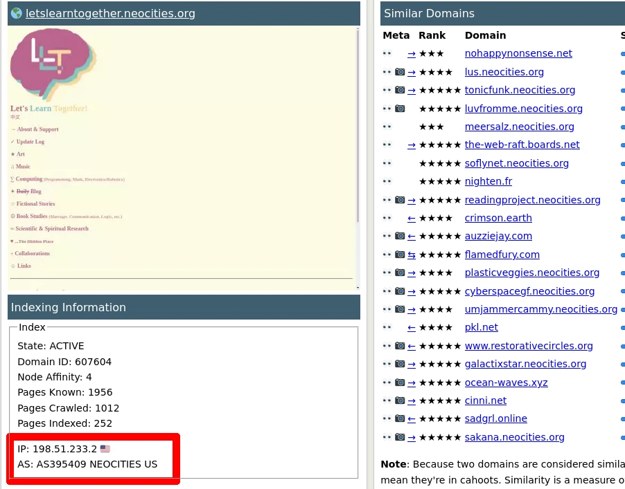

Marginalia Search very recently gained the ability to filter results by Autonomous System,
not only searching by ASN but by the organization information for that AS.  At a glance this
seems like a somewhat frivolous feature, but it has interesting effects.

Autonomous Systems are part of the Internet's routing infrastructure.  If your mental model of an IP
number is that they are the phone number of the computer, this is something akin to a postal code.
Digging much deeper than that into BGP and autonomous systems is not really in the scope of this article, but 
[Wikipedia](https://en.wikipedia.org/wiki/Autonomous_system_(Internet)) has a relatively lucid article on this.

In practice, this means you can add a keyword 'AS:47172', which is registered to Greenhost,
and only search among websites on this ASN.  You can also use 'AS:GREENHOST', which will
search among all ASNs registered to an organization containing that term.  Sometimes a single
organization will have several AS:es, especially cloud providers are good at this, so if for
whatever reason you wanted to remove AWS or Cloudflare from your search results, you can do 

    -AS:AMAZON
    -AS:CLOUDFLARENET

On a technical level this is implemented by just adding these terms, e.g. 'AS:12345' or 'AS:FOOBAR' as
keywords to the index.  There's already support for synthetic keywords that don't affect ranking and
have no count or positional information, so adding more is trivial and relatively cheap.  This is also how
e.g. the academia or recipes filters are implemented. 

<figure>
  
  <figcaption>ASN and AS org info for each website is also listed in the budding panopticon that is the <a href="https://search.marginalia.nu/site/letslearntogether.neocities.org?view=similar">
   site info view</a>. </figcaption>
</figure>

One reason for adding this is that adding more dimensions to the search engine is pretty much always useful in
creating filters.  This is better shown than explained; ["as:neocities -site:neocities.org"](https://search.marginalia.nu/search?query=as%3Aneocities+-site%3Aneocities.org&js=&adtech=&profile=)

What you're seeing in this query is a list of results domains hosted on neocities, but without a neocities domain name;
basically the graduate class of Neocities.  They're almost all fantastic.  Even though this is a
fairly technical filter, they share a certain vibe.  This could definitely be a new filter in the
sidebar some day. 

It's also useful when rooting out spam and content farms.  Spammers often use multiple IPs and
domain names, but rarely multiple hosting providers.  Means if you find e.g. casino spam I can just 
do a search 'online casino' across that ASN and swing the ban hammer relatively freely.

Part of the mission of the search engine is to show what the Internet looks like, and
autonomous systems are part of the hidden fabric of the Internet.  There's an impetus 
to hide the technical details of the world, but I think that's a devastating mistake.  

Hints of the existence of a deeper technical layer is how kids are inspired to become engineers.  
Turning technology into a magical black box arguably makes technology much less magical than
hinting at how that black box actually works.

Beyond that, in the age of enshittification, I think this is fairly important for a 
centralized open source project to be as transparent as is practically possible about 
all things by default. 

It's difficult to retain any sort of credibility while sitting on some [secret sauce](https://downloads.marginalia.nu/exports/). 
There are cases where sharing data or capabilities is harmful or illegal, but those are the exceptions.

If there's a way to show something or share a capability, where it's reasonably out 
of the way and doesn't impact the experience negatively, it really should be available 
by default.

## Further Reading

* [quaxio.com: Mapping an IP address to an ASN](https://www.quaxio.com/bgp/)
