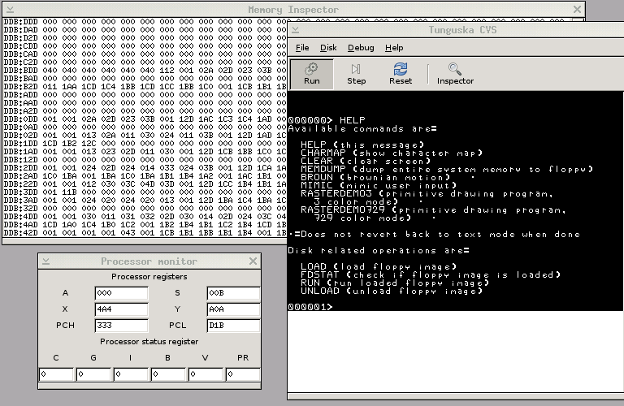
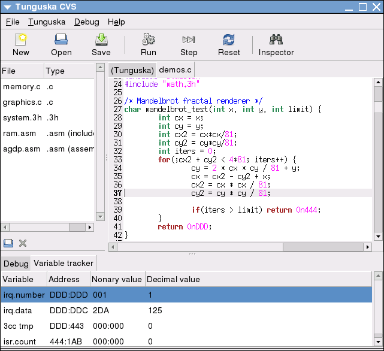

This is a bit of a retrospective of every project I've worked on, as far as I remember them. I've tried to unearth any artifacts that remain.

Far from everything is flattering and resounding success, but then again, maybe that's good.  There are definitely patterns in the things that 
didn't pan out.

# Earliest Traces

I was definitely programming stuff, but I don't think it ever amounted to anything tangible.  It was more like playing house,
I built GUIs that looked like real applications but didn't really do anything but look cool to me.  Real hackertyper vibes. 
This was in Java, Delphi and VB script mostly.  I also built a bunch of websites on geocities and angelfire.  This is definitely 
as far back as 1999.  I did some QBASIC stuff even earlier, like basic text based games and drawing circles and stuff.

# High School

I spent a lot of time in high school exploring Linux.  I used slackware, then gentoo.  Ripped these distros apart to see how 
they worked.  At one point I ran Slackware with all the init scripts stripped down to a minimum, booted very quickly but then
I had to mount partitions, run modprobe commands and set up network interfaces by hand.  In retrospect, I'm not sure why I thought 
this was a good idea.

I lived in the terminal, in blackbox, in vim, in IRC, in man pages and shell scripts.

## Pop3Share [C]

The earliest project I remember finishing was a strange file-sharing application that used the POP3 (email inbox) protocol.
The application would let you create a pop3 server that exposed files in a directory on the host system as though they were emails,
so an email client could download them.  Doing this with "large" files like 100 MB+ would crash many
email clients.

This was preceded by discovering the [RFC1939](https://www.ietf.org/rfc/rfc1939.txt) for POP3, and with great fascination
checking my ISP-provided email inbox with `telnet`.  

The application was mostly an excuse to play with sockets and `fork()`.  I'm not sure I ever thought there was much need for
a pop3 file sharing program.

I'm fairly certain [Beej'es famous network guide](https://beej.us/guide/bgnet/) 
was what I was following when doing this.  This was built in C, and I remember spending a great amount of time fiddling with linked
lists to get the "perfect" implementation.  I was also proud my program had reached a gargantuan 5000 lines, felt like a lot at the 
time, and it had reached this goal without imploding under my bad coding practices.

My "stack" at this point and for a few years forward consisted of C and Linux syscalls. 

This must have been in 2003-2004, since I definitely built this sometime early in high school.  The sources are lost to the mists
of time, but I found [a single reference](http://softwaresearch.jp/new/soft_add.php?6051) on this Japanese website. 

## Network Chat Program [C and Java]

Emboldened by the "success" with pop3share, I doubled down on the Beej guide and built a group chat app.  

First in C and then in Java.  It used UDP broadcast to talk directly to other clients on the same subnet, much to 
the chagrin of the sysadmins at school.  The C version had a bit of an 'irssi' GUI that I rendered directly with 
[ANSI escape codes](https://www2.ccs.neu.edu/research/gpc/VonaUtils/vona/terminal/vtansi.htm).  

I don't think I ever published the sources, but it was all very basic and ad hoc.  

I also posted asking stupid questions about C in broken English a few times on `comp.lang.c` in this period. 
These used to show up in search engines, but I guess no search engine indexes usenet archives anymore.

In this time I think I was very fascinated with piercing the veil and discovering more about how technology worked.  Being able to 
tell the terminal to do stuff like move the cursor by outputting secret sequences of characters was so up my alley.

## ? A BASIC interpreter (?C?) ?

(for some loose definition of BASIC) -- don't know how far I got, but I remember being impressed I was able to parse the syntax
using a very naive parser.

## ?Minor game projects [C++; SDL]?

(Nothing remains)

## Software Synthesizer [C++; SDL]

At this point I was bored in math class and playing with a graphing calculator, leading to discovering a few [Fourier series](https://en.wikipedia.org/wiki/Fourier_series). 
Using certain rules and select coefficients, you could add multiple sine waves to get a square wave, or a triangle wave.  I was curious to learn how such waves sounded.

This led into a detour where I built a software synthesizer.  I didn't really have anyone to ask how to do this, and didn't have the vocabulary to find 
resources at my level of understanding of music (which was basically nonexistent), so I had to figure out most of the stuff out on my own.  The synthesizer 
either wrote directly to the /dev/dsp [OSS] device, or wrote raw wave data to a file.  It captured keyboard inputs via a SDL window.

I eventually found wiki articles on a few filters I was able to understand and implement.  It used a declarative configuration language, 
everything looked a bit like a C struct definition.  It was capable of composing multiple wave forms, and had envelope shaping according to some
ADSR-scheme.

# University 

I studied physics, but many of the classes were pretty easy so I had a lot of time to work on hobby coding.

## Software 3D rendering [C or C++; SDL]

One of the first classes for engineering students at university was linear algebra, and I took to it as I quickly realized the applications in 3D rendering.  I built a very basic
spaceship simulator.  Like Descent, except every object in the universe is a rectangle.  Never before or since have I quite crushed an exam quite like that Linear Algebra exam.  No code survives.

## ? A bunch of fractal rendering stuff ? [C]

This would have been after Linear Algebra, since I'm doing 4D rotation matrices.  I dug up the sources a few years ago.  I don't remember much of this, but this is one of the outcomes
re-rendered in 2021.  [This inscrutable C++ code survives](nebulabrot.cc).

<iframe width="560" height="315" src="https://www.youtube-nocookie.com/embed/dZnxJko7ybQ?si=d31aSJiKsVrXZGcS" title="YouTube video player" frameborder="0" allow="accelerometer; autoplay; clipboard-write; encrypted-media; gyroscope; picture-in-picture; web-share" allowfullscreen></iframe>

## Tunguska [C++; 2008-2011]

[https://tunguska.sourceforge.net/](https://tunguska.sourceforge.net/)

[https://github.com/vlofgren/tunguska](https://github.com/vlofgren/tunguska)

The next rabbit hole was trinary computing.  I think I just found it on wikipedia and became fascinated.  In order to figure it out, I decided to
build an emulator for a trinary computer, loosely based on the 6502 instruction set.  This got incredibly out of hand and by the time I graduated from
university, the thing had an assembler, a small OS, an IDE and debugger written in GTK+, and a C compiler (for some very loose definition of C called 3CC)
since you know, the entire logic system is different.  

<figure>
  
  <figcaption>Debugger</figcaption>
</figure>

<figure>
  
  <figcaption>IDE.  Of course it has syntax highlighting :D</figcaption>
</figure>

Here is Pong in trinary 6502 assembler: [pong.asm](pong.asm)

It's funny looking back at this, I was very steeped in academia at this time in my life, and a lot of the stuff I produced [looks funny](math.tools.for.balanced.bases.pdf) as a result. 

It was a fun project, if a bit, you know, Terry Davis.  I did have a few users, mostly in or from Russia, as trinary computing historically has been a research
interest in the Soviet Union.  Ultimately I didn't have the time and wanted to move on, and it's been gathering bitrot and cobwebs since.

## ?? More DSP stuff ??  

Was into building soft modems, Fourier transforms and stuff.  A lot of the same ideas from the synthesizer, except with undergraduate mathematical skills rather than high school -.  No code survives.

## [[ Aside; XKCD's forums ]]

At this time, the now defunct XKCD forums were one of my favorite watering holes, and its coding subforum was a fantastic place to be for a young programmer. 
The 'Coding: Fleeting Thoughts', an bazillion page thread for casual discussion was where a lot of cool discussions happened.  It was frequented by some very 
smart people, but was still welcoming and chill.   It exposed me to a lot of new ideas and definitely made me step up my game several notches.  Speaking of notches, 
one thing I fondly remember about this forum is when (the) Notch demoed a very early version of what would become Minecraft in one of its threads.  

The loss of this forum is mourned.  I went by the handle "You, sir, name?" for years before anyone realized it was a pun.

## A concatenative stack-based functional programming language [2009? C++]

Yes.  All the paradigms at once.

There was a lot of talk about functional programming, and in what was at this point time honored tradition; to figure out more about how they work I decided 
to create one of my own.  It was as bit of a forth-meets-lisp thing.  The idea was as cool as it was nebulous, but I just didn't have the experience for 
this type of work yet.   Although it had become much rarer for my projects to implode, the language sort of fell apart under my own inability to implement 
a garbage collector.  

# Work

At this point I graduated, and got a full time job in software.  For a few years I didn't have time or energy for any hobby projects.  I did learn quite a lot about working 
on larger projects in the meantime.  This filled in a few gaps I had about development practices and software architecture that had been the cause of my software implosions. 

This isn't intended to be a resume, so I'm skipping any and everything I've done professionally, except to say in a broad sense, I was working on high high reliability Java 
applications in fintech most of the 2010s.

## Gamedev stuff [C++/SDL; 2014-2015]

I did a bunch of gamedev projects.  I was mostly interested in figuring out how games work, so I built the engine myself.  Below is a video from when I was playing with a
Commander Keen-style game.

<iframe width="560" height="315" src="https://www.youtube.com/embed/75khszlpHY8?si=9YgRva77Fo1voqSH" title="YouTube video player" frameborder="0" allow="accelerometer; autoplay; clipboard-write; encrypted-media; gyroscope; picture-in-picture; web-share" allowfullscreen></iframe>

## Dabbled in Haskell [ 2015? ]

Ported [Parsec](https://hackage.haskell.org/package/parsec)-style monadic parser construction to Java Generics as a shitpost entry for a hackathon at work.  I sadly didn't save the code.

# Sabbatical [2016]; part-time work [2017-2023]

I had a bit of an Office Space moment and re-evaluated my relationship with office work.  Took a sabbatical most of 2016.  Didn't produce a singular line of code.  It was great.  Came back and I've worked
32 hour weeks since.   Explored other hobbies, which is good.  Don't limit yourself to being a computer guy.  Just be a guy instead.  

This was kind of a painful period of my life, but I think it was good.  I came out more well rounded and happier as a result.  

I was pretty disillusioned with programming at this point and for a few years forward, did contracting work for a few years. 

## marginalia.nu [2019-]

(Some people tell me 2016 was eight years ago and 2019 was five years ago. I reject this blatant misinformation.)

Some years since the dark night of my soul, I was happier, but something was still missing.  Like an itch I couldn't scratch, a quiet hunger that wasn't ever sated. 

I needed to create.

I got a blog up and running on an old Raspberry PI that had lingered in its box for years.  It was in Swedish and didn't really have an audience, but that wasn't the point either.  I was on 
a philosophy bender at this point, and felt like I needed to write down some of [the thoughts](/misc/dialogue/) all these novel ideas were stirring up.  This in turn did sort rekindle an old flame, reminding 
me of how fun and rewarding programming can be.  It reminded me that I used to run web services for fun (and it really was fun.) 

So I started working on this... dunno, service mesh?  A bunch of Java processes that talked to each other and did small tasks.  I had a weather forecast service, 
a podcast aggregation service, a reddit fronted, and so on.  I built stuff I felt I needed.  I'd never really done that before, instead mostly following my curiosity.
It wasn't so much for the fun of building it, but just to replace frustrating services I had to put up with.  

It's an interesting thing though, as an experienced programmer, you can just build something that solves a problem you have.  Makes you a bit like a wizard.

This marks a subtle shift from exploring cool technology to using boring technology (like Java) to explore interesting concepts. 

## memex.marginalia.nu [2019; Java]

I built a hybrid [gemini](https://geminiprotocol.net/)/HTTP hypertext engine thing...?  This is recent enough for there to be a [writeup](/log/71-memex-design/).
Hypertext is cool and remains very slept on.  Probably one of the greatest innovations in the previous century.  Shame we're paving it over with web applications,
when it could be so much more.

## encyclopedia.marginalia.nu [2021?; Java]

[https://encyclopedia.marginalia.nu](https://encyclopedia.marginalia.nu/) -- this is a revamped version.

Another hypertext exploration.  I was interested in the nature of distraction in web design, and decided to build a minimal-noise wikipedia mirror.  

This is basically the [first blog entry](/log/00-linkpocalypse/) on the current website, so to avoid a biographical singularity; writing an infinite 
play-by-play breakdown of editing an entry in about this blog post about the blog post I'm currently writing, I'll terminate the process here.

