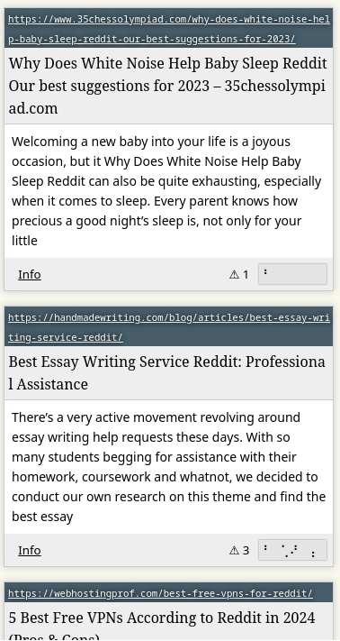

One of the great joys of working on a search engine is that you get to reverse engineer SEO spam, and overall study how it evolves over time.

I've been noticing the search engine spam strategy of adding 'reddit' to page titles for a few years now, but it feels like it's been growing a lot recently.  I don't think it's actually *working*, but it's so cute that they are trying.

<figure>

<figcaption>A spammy article with the title 'Best Online Slot Casino Reddit'</figcaption>
</figure>

<figure>

<figcaption>Several obviously spammy search results from Marginalia Search with 'Reddit' in the title </figcaption>
</figure>

The "white noise baby reddit" item has an interesting word salad quality to it.  Reminds me of the [A Japanese Toaster You Can Fuck](/weird-ai-crap/toaster.webp) listicle I discovered a while back, which to this date is my all time favorite SEO trainwreck. 

<figure>

<figcaption>A spammy article with the title 'Neorethindrone Weight Loss Reddit'.</figcaption>
</figure>

This one was actually from an academic domain.  That's an interesting mix of old blackhat SEO and newer query sniping strategies.  

Educational domains are high value targets because they tend to have very good pagerank.  Academic institutions link to each other, and ranking algorithms are often tuned to ensure academia is seen as an authority.  

Hacking into them or otherwise sneaking links in there seems very common.  Using the academia filter in Marginalia Search and searching for any high-spam topic (casinos, sex, online pharma, essay writing, etc.) usually crops up more than a few results that are almost definitely the result of a digital break-in.

Here's for example a compromised Wordpress installation from Tulane University, where someone's uploaded numerous spammy articles.  While showing this may seem embarassing for Tulane or the people involved, I want to strongly emphasize they are far from alone in having this problem.

<figure>

<figcaption>Several articles about gambling and porn on a *.tulane.edu domain</figcaption>
</figure>

I'm singling this website out because it seems to be *very* visibly compromised, and may possibly be actively used for botnet command-and-control:

<figure>

<figcaption>Blogpost with just a bunch of numbers</figcaption>
</figure>

I've written before about the phenomenon of these [hidden content-farms on compromised wordpress instances](/log/20-dot-com-link-farms/).  

The instinct when discovering that a wordpress instance has been hacked to host this sort of content is to cover up the problem.  It no doubt feels embarrassing.  Covering it up makes it looks smaller.  It's not a small problem.  It's a huge problem for the Internet at large, for search engines, for webmasters, for server administrators.  

This is an almost industrialized process, where it takes minutes from opening an HTTPS port to bots discovering it and probing it for compromised software.  I think we should be talking about it more.
