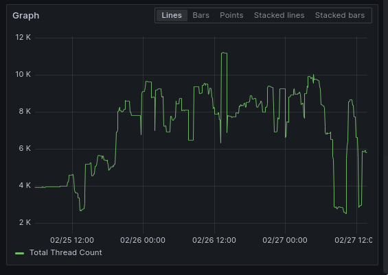
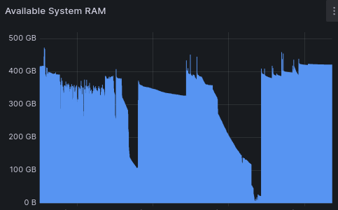

I set out a little over a week ago to add a service registry to Marginalia Search,
primarily to reduce its dependence on docker.  I would like it to be able to run
on bare metal as well, which poses a problem since configuring the application manually
is a bit of a headache with dozens of ports that need to be set up.  It would also be 
desirable to be able to run multiple instances of important services in order elliminate
downtime during upgrades.

Before the project was a search engine, it was originally just me messing with 
distributed software, where eventually a little framework emerged based on a 
strange mixture of Spark and RxJava. 

Based fresh familiarty with the difficulty in service discovery, I opted to base the 
new service registry thing on Zookeeper, which is a robust key-value store that's 
designed for orchestrating distributed software.

The services basically poke their connection details into an ephemeral node in zookeeper,
which means zk will remove the entry if the service has hasn't called in for a while. 
It's a bit finnicky to get right, but after a few days I got it working pretty well.

I landed on a two-phase process where each service registers itself, and then announces
their liveness once all setup is done, to avoid race conditions where clients try to connect
before the service is ready.  

At this point I noted the services weren't un-registering properly, and after some debugging 
it became apparent that the docker images I was constructing weren't termination signals properly, 
so that Java's shutdown hooks weren't running.  Java's shutdown hooks only run on SIGINT, and not
SIGTERM which was what it received.

The way I was creating the images was kind of janky, so it felt like a good opportunity 
to fix that.  I decided to migrate to jib, which is pretty good and reduces the image build 
time to a third.  Another upside of this though is that I was able to migrate to graalvm
for the docker images, which resulted in a very nice performance boost. 

Although migrating to jib meant I needed to modify how child processes are spawned, since it
uses a distroless base image which broke some assumptions.

The system spawns separate processes for e.g. the crawler instead of running the crawling 
logic inside some other host process, this is done to be able to configure heap sizes and 
so on separately, and to contain crashes and other issues to the crawler process.  

The solution was to spawn a new java process directly, pointing it to the classpath 
of the parent process, and specifying a different main class. 

Additionally, docker's liveness checks broke, because the images don't have curl in them anymore,
so I ended up moving most of the service dependency handling into zookeeper instead.  It's really
only a single dependency that matters, which is that the process responsible for db migrations starts
first on first-boot.  Having this managed by zookeeper means that the processes start faster, since
they don't need to "just-in-case" wait for first boot.

Anyway! Back to the problem at hand. 

This was also a good opportunity to clean up the last vestiges of the aforementioned
service framework, which was a weird rxjava based REST client base.  It has worked well,
but has also been slow and kind of janky since it did not offer much in terms of type safety,
not even urlencoding capabilities.

The project's internal communication was already half-migrated over to gRPC, so the plan was
to migrate what was left, and then kill the rxjava-based client.  Again, this went reasonably 
well, and the rxjava based client was successfully killed.

At this point I looked at the changes, and realized it's actually kind of dumb to register
services.  I should register APIs instead, and let the service registry worry about what is 
running where.  

Some refactoring later, I had broken most of the logic out of the services, into separate 
code modules I dubbed subsystems. These subsystems may talk to each other, but are oblivious
to whether they run within the same process or in separate processes.  

This turned out to be a very neat shift in paradigms, that effectively abstracts away most 
of the service topology from the application logic.  As a result, it feels a bit more like 
working on a monolith, even though it's really a jumble of services.  

(The reason why the system is broken into services is because there's a strong need to be able to upgrade
individual components of the system, while keeping long-running processes like the crawler, 
or slow-starting processes like the index up and running.)

Everything over to this new framework did cause some problems initially, due to how gRPC and Netty spawns threads
from a cached pool that is allowed to grow indefinitely.  I ended up with something like 10,000+ 
threads across the services in the system.  This resource leak ended up blowing up the RAM and 
at one point bringing the search engine offline.

<figure>

<figcaption>Total system thread count after migrating to the new code, before fixing the resource leak</figure>
</figure>

<figure>

<figcaption>Leaking RAM, OOM</figure>
</figure>

Chasing down and replacing all these cached pools with bounded thread pools was a significant 
bit of detective work, but eventually put a plug to the expanding RAM requirements.

On a brighter note, a baby client library came out of this work as well, that relatively 
painlessly keeps track of the service registry states, permits async calls, and so forth.

This whole thing could have probably taken like 2-3 days if it was just "add a service registry", 
and not over a week, but the upside is that a significant chunk of technical debt was taken out 
in the process.  Almost everything about the codebase improved in some regard, and the system got 
quite a bit faster and more capable in the process.

Here are [the sources](https://github.com/MarginaliaSearch/MarginaliaSearch/tree/master/code/common/service-discovery) if anyone is interested in having a peek.

