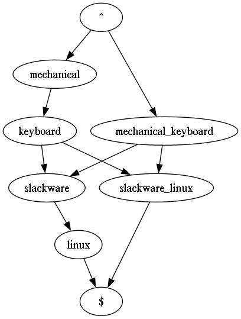
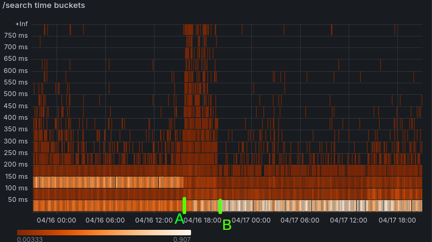

Been working on improving Marginalia Search query parsing and understanding.  This is going to be a pretty long update, as it's a few months' work.  

Apart from cleaning up the somewhat messy query parsing code, a problem I'm trying to address is that the search engine is currently only good at dealing with fairly focused queries, they don't need to be short, but if you try to qualify a search that is too broad by adding more terms, it often doesn't produce anything useful.

## Query Segmentation

A reason for this is that the search engine currently has a pretty primitive query understanding.  

If you provide it with a search query, it will require that all terms are important to the document, weighted by BM25, or they all appear in proximity.  This has its flaws.  If you consider a query like 'slackware linux package manager', then I think a human would see that there are two concepts in this query.  We can break it down something like this:

* (slackware linux)
* (package manager)

If 'slackware' and 'linux'; or 'package' and 'manager' appear close by each other, then that's probably indicative of a good hit, but whether 'slackware' and 'manager'; or 'linux' and 'package' appear close by each other is probably not very informative. 

This is a pretty well studied area, but many of the existing approaches require modelling based on query logs, which is something that Marginalia Search does not retain as a matter of principle.  

Search queries are very sensitive data and in my opinion, the only reasonable expectation of privacy is that they must not be retained for analysis.  Operating in this space it's also important to have a strategy for if a government comes requesting such information.  Simply not having the requested information allows full compliance with any legal requests without having to assume a risky adversarial position to the law.

Anyway, since there are no query logs to base a model off, other approaches are required.  

I experimented with using existing word vector models, since they ostensibly predict the likelihood of sequences of words, but could not get this to work very well.  It may be an avenue for continued investigation, as at least on paper it should be well suited for the task, but in the meantime, an evergreen font of concepts is Wikipedia.  This is explored academically in e.g. M Hagen 2010[1], which also offers a handy set of evaluation queries, the Webis-QSeC-10 dataset.  This will be a loose inspiration for the new model.

Extracting Wikipedia's article titles provides a manageable list of a few million word n-grams.  This data is a bit noisy, but the quality is sufficient for these purposes.  This information is amended with frequency information, extracted by counting how many times each concept appears in link texts or italics within the wikipedia corpus.

## Fast Phrase Identification through modified Rabin-Karp

The next problem is that given a search query, how can we test its substrings against a large lexicon in a performant fashion.  We want this to be extremely fast, because we want to not only be able to test the limited number of substrings in the query, but it's preferable to also be able to do this against the crawl data to lift important ngrams out of the text. 

We might want e.g. "manage packages linux slackware" to match "[package manager] [slackware linux]".

With this in mind, it's appealing to just store the hashes of the strings in a hash table.  The benefit of this isn't obvious in a vacuum, but fixed width hashes has a desirable property that you can combine them, and depending on the mathematical properties of the combining function, neat effects may fall out of the process.

What we're looking to build is something like the the Rabin–Karp algorithm, a sliding window that scans over the text, and identifies each word n-gram segment of a specific length.   Instead of building a single rolling hash like you would with R-K, which does substring search, we'll use hashes of words to construct a new hash instead, that we can add and remove components from.  

(A hidden agenda behind this is to be able to re-use hashes to find substrings of different lengths without rehashing.)

Consider if for example we combine hashes with the bit-wise XOR function, we'd find that we can undo the the combination of hashes by just xor:ing again.

This has a property that is desirable for testing whether it's worthwhile to permute a term, since XOR is commutative, but it's not sufficient for determining whether to segment an n-gram as we also get strange behaviors when the same word appears multiple times in the same n-gram (undoing itself), and there's a lot of false positives since we match any n-gram that has the same words in any order:

```
F(africa) x F(south) x F(africa) = F(south)
F(south) x F(africa) = F(africa) x F(south)  
```

To determine whether to segment, we want a combining function that has an inverse function, but that is not self-inverse.  To this end, combining hashes by rotating the bits of one of the components to the left and then bitwise XOR:ing them works better.  

```
f(a,b) = rotate-bits-left(a, 1) XOR b
F(a,b,n) = rotate-bits-left(a, n) XOR b
```

This pair of functions lets us undo earlier combination after successive application, but is not commutative, and not self-inverse.  

It's very fast, enough for the side-objective of keyword extraction in the hundreds of billions of tokens in the crawl data as well, to highlight noun words and terms of interest for faster priority indexing.  The search engine already does something similar, but using hints such as capitalization and grammar/POS tagging, but this misses a fair bit of keywords.  

It isn't really feasible to index every arbitrary-length word-ngram, as the resulting token lexicon would be of a ridiculous cardinality, and it needs to be less than 4 billion items for key statistical tricks to work our way:  The search engine doesn't actually store the keyword lexicon, which would be enormous, but instead selects hash functions in such a way that collisions are rare.

This all cooks down to a fairly simple piece of code that can be run over a list of terms that will output any n-grams that are present out of a lexicon consisting only of hashes, while performing no string concatenation and only calculating each word hash once.  

The logic looks like this:

```java
public List<SentenceSegment> findSegmentOffsets(int length, long[] hashes) {
  // Don't look for ngrams longer than the sentence
  if (hashes.length < length) return List.of();
  List<SentenceSegment> positions = new ArrayList<>();

  long hash = 0;
  int i = 0;

  // Prepare by combining up to length hashes
  for (; i < length; i++) {
    hash = orderedHasher.apply(hash, hashes[i]);
  }

  // Slide the window and look for matches
  for (;;) {
    int ct = counts.get(hash);

    if (ct > 0) {
      positions.add(new SentenceSegment(i - length, length, ct));
    }

    if (i < hashes.length) {
      hash = orderedHasher.replace(hash, hashes[i], hashes[i - length], length);
      i++;
    } else {
      break;
    }
  }

  return positions;
}

/// ...

class OrderedHasher implements HasherGroup {

  public long apply(long acc, long add) {
    return Long.rotateLeft(acc, 1) ^ add;
  }

  public long replace(long acc, long add, long rem, int n) {
    return Long.rotateLeft(acc, 1) ^ add ^ Long.rotateLeft(rem, n);
  }
}

```

The code assumes the hash function is nearly perfect.  The same assumption is used in other areas of the search engine, and the approximation holds up surprisingly well.  The noisiness of the internet itself helps plausibly mask any hash collisions that do appear:  Even without this approximation, the noisiness of the search results wouldn't be significantly decreased.

Since a good while back Marginalia hashes its keywords with a modified version of Murmur 128 that make assumptions that the string is mostly 7 bit ASCII, but hedges its bets by seeding the Murmur hash with a basic polynomial rolling hash function.  There's more to be said about the trade-offs in doing this, but in brief it benchmarks five times as fast as Guava's Murmur 128 hashes and nearly twice as fast as Common Codec's implementation, which it is based off, while doing a decent job balancing the interests of speed while still being a useful hash function for the applications at hand.  [src](https://github.com/MarginaliaSearch/MarginaliaSearch/tree/master/third-party/commons-codec)

## Query Construction

The next problem is one of representing the query during construction.   

A directed acyclic graph is a decent choice, especially with a predetermined start and stop vertex.   This permits the construction of rules that walk the graph and add new paths based on some rule set, either through the segmentation logic above or based on grammar or something else.  The search engine has previously had rules for e.g. taking the word AC/DC and generating the variants ACDC and AC DC.  This isn't always the right move, sometimes separators are significant, there's a big difference between "free sex-movies" and "sex-free movies", for example, but in general it improves recall.

As a side-note, it's a popular sentiment that a search engine should only perform the exact search that is entered.  Usually this is fuelled by some intuition from e.g. "grep", which works well on small bodies of documents, and a frustration with the opaque query interpretation used by some larger search engines.  This view isn't very well informed.  An internet search engine needs to do more than grep because the Internet is a very large and heterogeneous corpus of documents.  A binary criteria like grep's would not make a useful search engine.   That said, having a transparent and intuitive query execution and ranking model where it's obvious what the search engine is doing is important to avoid the frustrating case where users can't understand why they don't seem to get results that match the query.

While this DAG representation is very convenient when generating the queries, allowing very clear and succinct rules to be created without worrying much about the structure of the data, it's less useful for evaluating the queries and sort of awkward to move around. 

Returning to "slackware linux package manager", the equivalent DAG would looks something like this:

<figure>

<figcaption>Directed Acyclic Graph of the query "slackware linux package manager" courtesy of graphviz</figcaption>
</figure>

An intermediate representation is needed.  I decided on a simple LL(1) infix grammar.  

This was chosen in part because it's human-readable and trivial to tokenize and prase, to the point where recursive descent is almost overkill for the grammar.  To give an brief idea of what the grammar looks like in practice the compiled query "`( marginalia | wiby ) search engine`" matches "marginalia search engine" and "wiby search engine".  

Air is added between the grammatically significant tokens to permit longer search keywords to contain the symbols '(', ')', and '|'.  Escaping the operations would also have been an option.

Previously the search engine has dealt with variant queries by simply building a list of alternative queries, both during construction but also during evaluation, basically running multiple queries in parallel.  This is at first face good for performance, as these are trivial to run in parallel, but the possible complexity of the query is limited, and the total number of variants needs to be relatively low. 

Actually producing the new representation from the graph ended up being very surprisingly difficult.  I don't remember the last time I've quite struggled this much with what is ostensibly a simple coding problem.  After several false starts treating it as a graph traversal problem, eventually the solution I arrived at was to expand all the paths through the graph into sets of vertexes, and using a sequence of intersection operations to greedily find a local minimum.  Finding the global optimum was never needed, just something better than an enumeration of every possible combination. It should also be noted that these graphs are small and typically have fairly low complexity, with up to maybe a dozen vertexes and twenty or so edges at worst. 

## Query Evaluation

Queries expressed in the new intermediate grammar are passed to the index service.  It has two needs for this information, it's needed when constructing the queries against the index; and it's needed when evaluating the queries.  

The representation chosen was the one that benefits the ranking code, as this is both the most expensive part and the part that could most do with increased clarity as it's generally pretty hard to benchmark the result ranking code so it needs to be easy to reason about. 

The query is parsed into a simple grammar tree with an arbitrary number of children for each node.  After some consideration, the choice was made to to separate the topology of the tree from the data associated with the nodes, so that it's possible to associate the same topology with different data sets, and operate on the data independently of the topology.   

In one part of the code we may be dealing with a string representation of the keywords, in another their term id:s, and in another positions and flag bit-masks.

This makes much of the ranking code very simple, and it can be expressed through a mapping operation.  We can define an operation where we traverse the tree combining values associated with each node using two operations, one operation is mapped to combining sibling values, and another is mapped to combining child values. 

If we for example want to answer if a path exists where a property is true for each element, say "is the the keywords in the title", then we map "child" to logical AND and "sibling" to logical OR.  If we want to find the largest value of BM-25 in any path, we map "child" to sum() and "sibling" to max().  

These types of operations are all over the ranking code, and the result feels easy to reason about.  Not everything fits the tree-based approach to the query, but since the data is separate it's still relatively manageable to work with.

Overall it can't be overstated how much thinking through data representation pays off.  There are things in code you can fuss about forever that doesn't make a lick of difference, but fussing over how data is structured and modelled almost always pays off in spades.

Even though the new query parsing and evaluation models are definitely a fair bit more complex, much of the code actually feels simpler, almost as though large parts have been removed.  And in a sense it has, what has been removed is all the gunk needed to deal with having data structured inappropriately.  Often this feels like complexity essential to the problem, and intuition is quick to tell us it can't be simplified any further than it is.

Aside from generating new search terms, the segmentation information is also a constraint a limitation that the set of terms must appear in close proximity within the document. 

Regardless of segmentation, term proximity also feeds into two ranking parameters, one measuring the best position overlap of any path through the query, which rewards results where all terms appear close by, and the other is the average mutual [jaccard index](https://en.wikipedia.org/wiki/Jaccard_index) which rewards terms where some search terms are near by. 

Overall the ranking parameters are a bit poorly tuned right now as a result of these large changes.  This is expected and has historically always been the case after a large change.  My hunch is that some constraint is a bit too strict, as the search engine tends to return a bit fewer results.  Debugging this sort of thing is a fairly time consuming process of identifying something that's unexplainably higher or lower in the rankings than it should be, and trying to figure out what is causing that.

## A Brief Query Construction Trainwreck

I initially attempted to use the new query structure to create fewer more complex queries against the indexes, basically using union and intersection operators to combine multiple keywords into one operation.  

This resulted in a massive performance degradation with many queries taking upward of a second to complete. 

Flattening the variant subqueries and running them in parallel reversed the problem, and instead lowered the average response time a fair bit.  

It reinforces the lesson that a primary bottleneck in processing large amounts of data is single core memory throughput.  Some outliers are always expected, but during the performance degradation, all queries felt noticeably slow, with 90th percentile values going from 150ms before, to 300ms during, to 110ms after. 

<figure>
<a href="regression.png"></a>
<figcaption>Heatmap of request times, initial deployment marked as A,  workaround marked with B. </figcaption>
</figure>

Deploying several months worth of changes into production is inevitably a bit stressful.

## References

[1] Query Segmentation Revisited, 2011, M. Hagen et al. [pdf](https://www.cse.iitb.ac.in/~soumen/doc/www2013/QirWoo/HagenPSB2011QuerySegmentRevisit.pdf)
