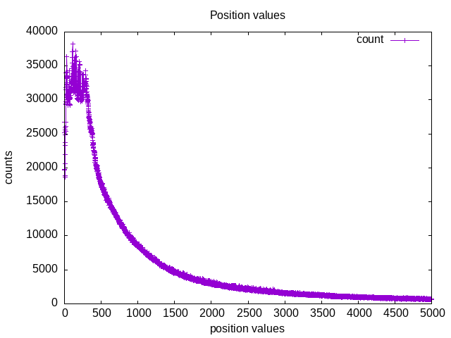
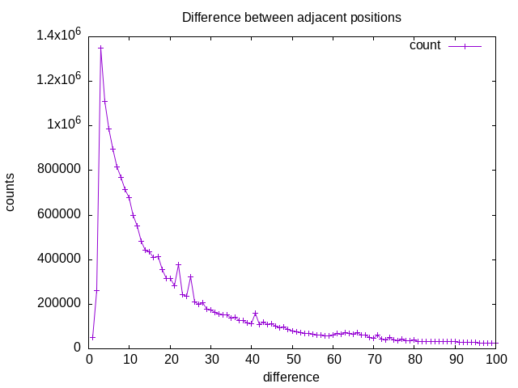
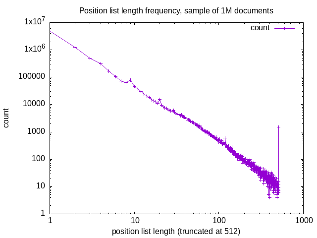
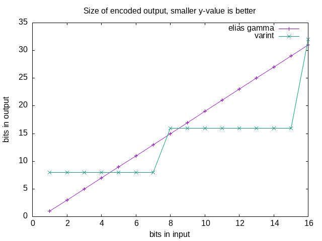
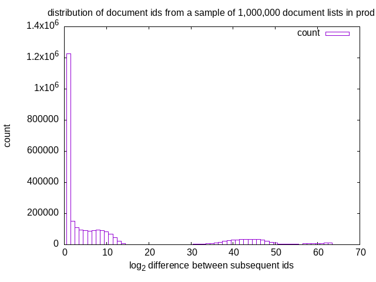
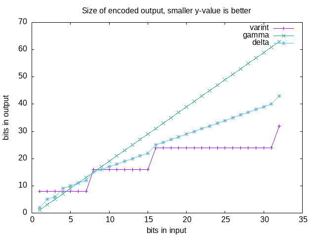

Marginalia Search now properly supports phrase matching.   This not only permits a more robust implementation of quoted search queries,  but also helps promote results where the search terms occur in the document exactly in the same order as they do in the query.

This is a write-up about implementing this change.  This is going to be a relatively long post, as it represents about 4 months of work.

I'm also happy and grateful to announce that the nlnet people reached out after the run of [the grant](../a_107_nlnext) was over and asked me if I had more work in the pipe, and agreed to fund this change as well! 

## The old design
Previously the positions for each term in the documents were stored in an approximate fashion.  56 bits were assigned to each word, and each bit corresponded to a set of positions in the document, with a sentence-level granularity.  This can be very loosely thought of like a bloom filter.  

To deal with quoted search queries, the search engine would try to guess relevant word n-grams and store them in the index along with the rest of the keywords.  "Steve Jobs" was simply stored as the keyword *steve_jobs*.   It would be logistically impossible to store all word n-grams present in every document due to combinatoric explosion, so limiting heuristics were needed to identify which were likely to be important.  This used both grammatical analysis and word lists like wikipedia titles.

This covered cases like "to be or not to be", because it was such a well known sequence of words and identifiable as a word n-gram, for many queries these approaches worked adequately, but a number of cases cropped up where the approach did not work.  

A good example comes from a friendly detractor on hacker news, who had discovered that the query \[the vietnam of computer science\] turned up nothing but vietnamese computer scientists, and nothing about the famous blog post "ORM is the vietnam of computer science".

What the search engine did when it saw the query was first to remove stop words:

 <pre>
   <s>the</s> vietnam <s>of</s> computer science
</pre>

then it expanded the query with possible n-grams to help the query

<pre>
  vietnam, computer, science -> computer_science
</pre>

It's seems pretty straightforward from this processing that it would indeed find computer scientists in Vietnam.

To adequately serve the query, exact positions were needed so we could get away from the word ngram guessing game and sentence-level position matching.

## Representing positions lists

Thankfully, this is well trodden ground in information retrieval, and the literal textbook solution is to just store a compressed list each position of a term in the document as a list of positive integers.

The positions themselves tend to be on average small, but the distribution is fairly wide and large values are a common sight.  To give an intuition for this, I'm attaching some plots.

<figure>
<a href="pos-abs.png"></a>
<figcaption>Plot of the number of document positions for a given length.</figcaption>
</figure>

The data can be better behaved by calculating the difference between each position, to get a list of smaller numbers.  The statistical distribution is still fairly diverse, but since words tend to either be common and appear in many sentences, or cluster up in a few sentences of a document, you get a lot of very small values when you look at the relative difference in position. 

Plotting the difference between position values, we see the number of large values has drastically been reduced.   There is still a tail of larger values, but it tapers off much faster.

<figure>
<a href="pos-delta.png"></a>
<figcaption>Plot of relative distance between adjacent positions in a sample of positions lists.</figcaption>
</figure>

For compression of a list of monotonously increasing positive integers, several options are available.  I initially implemented Elias gamma coding, which is a simple variable bit width code that is  effective for very small numbers.   

<div style="border: 1px solid #888; padding: 0.5ch">
<strong>Elias Gamma Code: </strong>

In short, you count the significant bits in the number to be encoded, subtract one from that count, and then you prefix the number to be encoded with that many binary zeroes. 

<strong>Example:</strong> To encode the byte 56, or 0011'1000<sub>2</sub> in binary, note that there are 6 significant bits: 

<pre>
   00<u>11'1000</u><sub>2</sub>
</pre>

We prefix the significant bits with 6-1 = 5 binary zeroes

<pre>
   <u>000'00</u>11'1000<sub>2</sub>
</pre>

And thus we've arrived at the 11 bit encoding of the number 56!  Just mind that the leading zeroes are significant.
</div>

This is frequently used in combination with other techniques as part of a compression algorithm, but in our case since the data to be compressed was already a series of small positive numbers, Elias gamma seemed like a good choice as-is.

In terms of functionality, this worked very well, but later during performance testing it was found to not be quite performing well enough.  Since the code is variable bit and not octet aligned, it's always going to be a bit slow on modern hardware.

Plan B was to use varints instead.  The varint coding scheme is also relatively easy to implement, and more importantly quite a lot more CPU-friendly.

<div style="border: 1px solid #888; padding: 0.5ch">
<strong>Varints:</strong>

The flavor of varint encoding chosen uses the highest bit as a continuation flag.  The value to be encoded is grouped into segments of 7 bits, and all the the least significant grouping of bits has its 8:th bit set as a continuation flag.

<strong>Example: </strong> To represent the number 700 (0010'0101'1000<sub>2</sub>), we first break into groups of 7 bits

<pre>
  <s>0000'0</s>100<sub>2</sub>  (bits 10-7, padded to byte)
  <s>0</s>101'1000<sub>2</sub>  (bits 7-0, padded to byte)
</pre>

Then set the highest one bit to signal continuation for all but the lowest byte
<pre>
  <u>1</u>000'0100<sub>2</sub>
  <u>0</u>101'1000<sub>2</sub>
</pre>
</div>

There's a large number of varint variants and relatives, but this is favorable for our use case as it favors decoding efficiency over encoding and deals well with the common case of just having a single small value to encode. 

Since the statistical distribution of the data is strongly biased toward small numbers, that case can be broken out into its own if-statement when decoding the values.  This is very branch predictor friendly and makes the code about 20% faster on real-world position data.  

```java
byte b = buffer.get();  
if ((b & 0x80) == 0) {  
    // this is the most common case
    return b;  
}  

// the case where there are multiple bytes:
int value = b & 0x7F;  
do {  
    b = buffer.get();  
    value = (value << 7) | (b & 0x7F);  
} while ((b & 0x80) != 0);  
  
return value;
```

In many cases this type of micro-optimization would not see much actual impact, but this code is so hot it really does make a significant difference.  Overall this is approximately twice as fast as the gamma code implementation, and half as fast as just reading the data from an array.

There are even faster vectorized implementations of varints (e.g. Lemire et al's [Stream VByte](https://arxiv.org/abs/1709.08990)), but I've been unable to get them to perform well in Java, largely due to inadequate access to the [PSHUFB instruction](https://www.bazhenov.me/posts/rust-stream-vbyte-varint-decoding/). 

There are also reasons to expect Stream VByte may not perform well in this particular instance:  The length of the lists follows via eyeball statistics an apparent pareto distribution that is heavily biased toward very short lists, weighted average length is less than 4, and because of this looking at vector operations is likely not going to be as useful as it might seem.

<figure>
  <a href="poslistlength.png"></a>
   <figcaption>Log log plot of the number of positions lists lengths for a given length.  Outlier at 512 is because this is the maximum permissible length, longer lists are truncated.</figcaption>
</figure>

### Size and shape of the coded data 

When switching to varint, a concern was that varints might use more disk space compared to the gamma code representation, but it turned out to largely be an even match. 

The gamma coded data lost a lot of its lead due to each positions list being rounded up to be byte aligned as a whole, and varints actually have a size benefit when representing numbers in the 32-127 range, a somewhat common case in the data.

If we plot the output size as a function of input size, we can see the two schemes are a relatively even match throughout the most common magnitude of values under 1000.

<figure>
  <a href="bitsizes.png"></a>
  <figcaption>Number of bits in output as a function of number of bits in input for the gamma and varint codes</figcaption>
</figure>

Even though the choice in coding scheme doesn't seem to have an impact on the size of the position data, the position data does require additional disk space!  About 85 GB per index partition, of which there are currently 9, so roundabout 700 GB in total. 

It was possible to redeem this disk space usage by shrinking and compressing the priority index, see Appendix A. 

## Position spans

In the old design, each keyword would have a number of bit flags associated with it, containing information about whether it for example appeared in the title or in a heading.  

This is bit mask approach is again a fairly blunt tool, still useful in some areas, but since we've improved the position resolution by encoding positions lists, we also stand to benefit from a new approach for coding information about a individual occurrences of a word.  

The solution is very similar to the positions list.  For each field, we store a coded list of start and end positions.

The span data for an imaginary document may look like this:

| Field    | Positions          |
| -------- | ------------------ |
| Title    | 1,6                |
| Heading  | 7,10,32,38,100,105 |
| Nav      | 11,20              |
| Code     | 50,72              |
| Body     | 1,11,20,50,72,120  |
| Ext link | 170,210            |

At this point the tools for representing lists of positions already exists, we just need to store a few more of them, with the added requirement that the size of the list is even, and the implied semantics that even positions are the starts of spans, and their succeeding odd position marks the end.   

This data is stored in a separate file from the positions and will be an additional disk read, but since we're always interested in all the data, we can consume all the data at once.

This turned out to be a very nice improvement that permits the search engine to index more of the documents. 

Previously, without this degree of precision information, the search engine would discard information from e.g. code blocks, because it tended to be less useful.  Now it can simply assign matches in code blocks a lower score, without outright discarding the data. 

The search engine stores all the information of the document in one go, separating the actual contents of the document from a block of e.g. external link texts by a segment of empty positions to prevent phrase matching from happening across different fields.

This is different from how general-purpose search engines tend to work, and a concession to the needs of web search, where you're virtually always interested in all the fields at once, and have an interest in budgeting the number of disk read instructions.

Intersecting term positions lists with these fields lists is relatively easy and performs very well due to the extreme cpu-friendliness of the operation.  

In practice the intersection algorithm switches between a linear and a binary search depending on the length of the data.

## Phrase matching and ranking factors

At this point, all the prerequisites are available to do phrase matching, but a few changes are still needed.  

To make the most of phrase matching, stop words need to go.  The stop word list was never very long in the first place, but turning "to be or not to be' into '? be ? ? ? be?' is not great.   Indexing every word grows the index and increases the amount of data that needs to be fetched in many queries, but it really can't be helped.  

The ranking algorithm also needs fairly extensive modification and tuning.  

Several new ranking factors are available with the change:

* The presence of the search query as a phrase in the document

	We can apply negative offsets based on the position of each keyword in the query to the corresponding position lists from the document being ranked, and if we find any case where these offset positions list overlap, we have a phrase match!
	
	We can also use these positions matches and intersect them with the field data, to lift information about *where* in the document the match is, whether it's in the title or a heading, or in a navigational element?
	
	This is a bit of a liability for a flavor of SEO spam called query sniping, where a document is crafted to specifically contain a query, and have it rank well because of its verbatim match. 

* The minimum distance between the keywords in the query in the document

	Finding the smallest distance between two items in a pair of lists is relatively trivial, but extending this to cover an arbitrary number of lists this turned out to be a surprisingly difficult calculation that was fairly resistant to optimization of the algorithm.
	
	The trick  that still permitted this to still be used turned out to be to attack the input data instead, and to omit positions lists if they were too long from the calculations, effectively excluding frequently occurring words from the calculations.  This appears to have small impact on the quality of the ranking signal, as the omitted words tends to appear all over the document and don't add a lot of information.

* The distance in the document before you've seen all keywords once

	Early occurrences are generally a good thing, although this is a secondary signal at best and should not be dialed up very high, as there are many examples of documents where a sentence appears early, despite being a somewhat mediocre search result.

There are also the old factors, such as two versions of BM25, and even some lingering word ngram data.  Putting all of this together and making it work well is a lot of tuning, and it's a pretty protracted process of manual adjustments.  

It seems to be in relatively good place now, but there's always more adjustments to be done.

All the ranking factors can be explored using the [qdebug utility](https://search.marginalia.nu/qdebug?q=platonic+solid), which is a tool I built to diagnose ranking problems.  It's very much a debug tool and not very user friendly, but I'm including a link mostly to highlight that this article is very much skimming the surface.  

# Conclusion

This has been a relatively a large change.  The PR consisted of over 200 commits, with a delta of nearly 20,000 lines of code changed, owing to the fact that this breaks binary compatibility for the index and hasn't been possible to merge until it's all done.

Overall it's been a success.   There are queries that the search engine can answer now that it could not answer before this work, and many queries that were decent before perform better now.

There's always some element of gamble when making a change like this, you don't know how well it will work until it's live in production, after one or more months of work.  

The feedback cycle in web search engine development is very long, probably longer than anything I've ever encountered in programming.  Rebuilding the index in the test environment, which has about 10% the data of production, took 2.5 days.  It was possible to get that down to 1.5 days toward the end of this process, but it's still very long, and even still no tests or test environments can quite do production justice. 

Overall the approach taken to improving search result quality is looking at a query that does not give good results, asking what needs to change for that to improve, and then making that change.   Sometimes it's a small improvement, sometimes it's a huge game changer.  But it does seem like a solid vehicle for moving the search result quality in the right direction.

# Appendix A: Shrinking the priority index

The search engine uses two indexes, a full index that, as it says on the box, indexes everything.   It contains a mapping from keywords to a record with a document id, some document metadata, and a pointer into the positions file. 

The search engine also has a priority index, which only contains documents that are in one way or another seems strongly related a keyword.  Maybe it appears in the title, or an inbound link text, or some other relevance signal.

The priority index exists to help the search engine find the most relevant items first, as queries execute on a timer, and will terminate the search after a configurable time limit has passed and return the best of what's been dug up so far.

To keep things simple, the priority index was built using the same code as the full index, meaning it would store redundant information, and also contain structures supporting operations like fast intersection with other documents lists.

What the index was actually used for though was just to iterate through the document id:s from start to finish for each keyword. 

Originally the priority index was about 175 GB, but removing the metadata and additional indexing structures from the file, leaving it just an uncompressed list of document ids, brought the size down to 85 GB.  

This already redeems the cost of adding positions data, but at this point I was curious to see how much smaller it could get if I compressed the ids.  Trouble is that since these ids are constructed by concatenating different components, they have a really nasty statistical distribution that does not favor basic difference-coding schemes.  

There's a longer rationale behind these constructed id:s in the post [Absurd Success](../87_absurd_success/), but in short they're constructed to allow intelligent re-use of id:s to keep the document ids in a 64 bit long. 

The document id construction scheme looks like this:

| bits  | purpose           |                                                                                              |
| ----- | ----------------- | -------------------------------------------------------------------------------------------- |
| 0-26  | document ordinal  | unique within document id, not<br>persistent over time                                       |
| 26-56 | domain id         | id of the domain                                                                             |
| 56-63 | ranking component | used to change the order of<br>domains in the index so that<br>important ones appear earlier |

This gives the difference between subsequent document id:s has a statistical distribution with 3 modes:

* Bits 0-26 change by a small amount
* Bits 25-56 change by a small amount, bits 0-26 change unpredictably
* Bits 56-63 change by a small amount, bits 0-56 change unpredictably

<figure>
  <a href="docidhisto.png"></a>
  <figcaption>A histogram of the magnitude of difference between adjacent document ids in a priority document list</figcaption>
</figure>

The first mode is by far the most common, and benefits from something like the Elias gamma code, whereas the second and third modes are so large as to behave very poorly under such a scheme.

I ended up constructing a compression scheme for this by hand.  

First a code is specified using two bits, then an unspecified number of bits is consumed to increment the document id.  Each code is designed to cater to the modes mentioned before, and a fourth case is added to bootstrap the initial value of the list.

Expressed in terms of decoding:

The case when code=0:
* ordinal += read Elias gamma coded value

The case when code=1:
* ordinal = 1 + read Elias delta coded value
* domain += read Elias delta coded value

The case when code=2: 
* rank += read Elias gamma coded value
* domain = read uncompressed value
* ordinal = read uncompressed value

The case when code=3:
* read uncompressed document id

Here Elias delta is a coding scheme similar to Elias gamma, but favors slightly larger values. 


<div style="border: 1px solid #888; padding: 0.5ch">
<strong>Elias Delta Code: </strong>

The Elias Delta code is similar to the gamma code, except instead of using base 1 to code the bit width, you use the Gamma code. 

<strong>Example:</strong> To encode the byte 56, or 0011'1000<sub>2</sub> in binary, note that there are 6 significant bits: 

<pre>
   00<u>11'1000</u><sub>2</sub>
</pre>

Gamma code the number of significant bits - 1: 
<pre>
  gamma(6-1) = gamma(101<sub>2</sub>) = <u>00</u>101<sub>2</sub>.
</pre>

Prefix the significant bits of 56, 11'1000<sub>2</sub>, with gamma(6-1)
<pre>
   <u>1'01</u>11'1000<sub>2</sub>
</pre>

And thus we've arrived at the 10 bit encoding of the number 56!
</div>

<figure>
  <a href="bitsizes2.png"></a>
  <figcaption>Number of bits in output as a function of number of bits in input for the gamma, delta and varint codes</figcaption>
</figure>

### Outcome

This was remarkably efficient.  The compressed index is just 10 GB, down from the initial size of 175 GB, before irrelevant metadata was removed, indexes cleaned out, and any compression applied.

This result is better than zstd compression (25 GB), which isn't a huge surprise since custom compression schemes can often outperform general purpose algorithms when you have misbehaving data with strong human-understandable idiosyncrasies like in this case. 

Compressing the full index is significantly more complicated, but likely something I'll look into in the future (though it will mean another very large re-write...)
