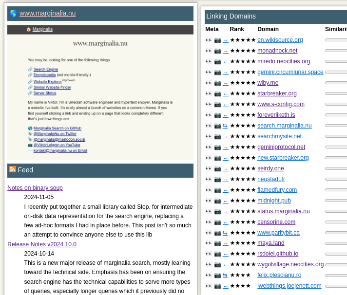
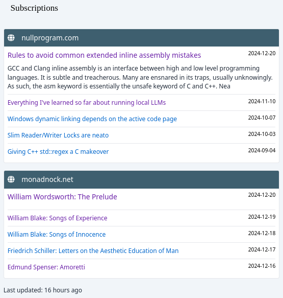

A while back an update went live that, with some caveats, changes the time it takes for an update on a website to reflect in the search engine index from up to 2 months to 1-2 days.  Conditions being if the website has an RSS or Atom feed.

The big crawl job takes about two months, and is run partition by partition, meaning there's typically a slice of the index that is two months stale at any given point in time.  To help compensate for this, a new crawler and index partition has been added that focuses on recently updated content.

## RSS/Atom

In principle keeping track of feeds is easy, and something the search engine has nominally supported for quite some while, although it was a bit of a janky set-up that required manually running a curl command every time it was to be updated.  Needless to say, it didn't stay up to date
very often.

Originally the plan was to put a simple RSS feed in the site inspection view, a nice addition and a good way of ensuring that the feed discovery and retrieval is actually working well.

<figure>

<figcaption>Weep at my inability to align the RSS icon with the text</figcaption>
</figure>

The [upcoming redesign of the search engine UI](https://test.marginalia.nu/) additionally has the experimental ability to subscribe to feed updates, to get a slow personalized news feed that updates daily.

<figure>

<figcaption>Preview of the subscription capability of the new search UI</figcaption>
</figure>

The setup for storing and accessing feed data is very simple.  All feed data is stored in a small sqlite database with a table consisting of a domain name and a JSON blob encoding the contents of the feed, when it was last fetched.  This works well, as there isn't much need of complex aggregations of the data, and even when such operations are needed, it's still perfectly performant.   There simply isn't that much data, about 1 GB per 250k feeds.

Periodically, the RSS fetcher will ask the search engine for all known feeds, and attempt to fetch them all.  This is a very slow process with a lot of bad URLs, so other times the feed fetcher will only attempt to fetch feeds it's successfully fetched before.    

However, when dealing with any sort of real-world web data, you quickly run into weird corner cases.  
### Feed Discovery

One catch is that while a website can indicate that it has feeds, there is no way to indicate which feed is canonical.  A website can have dozens, even hundreds of feeds, some CMSes generates one RSS feed per page, with entries for each comment in its comment section.  The best heuristic I've found to get around this is to pick the shortest URL that is discovered.   It's *usually* right. 

On the flip side, many more websites have RSS or Atom feeds than have &lt;link&gt; tags pointing them out.  To increase the number of feeds discovered, an alternate track is run when there is no link tag, where the crawler will probe a few paths that are likely to contain a feed, and then sniff the first 256 bytes of the response for &lt;rss&gt; or &lt;atom&gt; tags.   

This approach seems to increase the number of feeds discovered by 25%, though about 5% of the discovered feeds are form medium.com, which has a link tag that points to a different domain than the medium blog, interacting poorly with the search engine that denies such cross-domain feeds; while at the same time having a same-domain feed that is viable.
### Parsing 

When parsing feed data, it's relatively common to encounter XML errors, as many directly inject HTML into their feeds, perhaps sanitizing the angle brackets, but not without properly sanitizing the HTML entities.  

The problem with this is that XML has a much smaller number of named character entities by default, so some logic is needed to attempt to translate HTML entities into some string equivalent, or failing to do that, escaping the character entities with &amp;amp;s, which will lead to some mangled text, but will at least not cause the XML parser to catch fire.

There's a helpful [wikipedia article](https://en.wikipedia.org/wiki/List_of_XML_and_HTML_character_entity_references) that offers a deeper dive into the difference between the XML and HTML entity sets. 

<blockquote>
XML specifies five predefined entities needed to support every printable ASCII character: <code>&amp;amp;</code>, <code>&amp;lt;</code>, <code>&amp;gt;</code>, <code>&amp;apos;</code>, and <code>&amp;quot;</code>
</blockquote>

The [RSS advisory board](https://www.rssboard.org/rss-profile#data-types-characterdata) further states amidst its annoying interstitial links:

<blockquote>
A publisher <em>should</em> encode "&amp;" and "&lt;" in plain text using hexadecimal character references. When encoding the "&gt;" character, a publisher should use the hexadecimal reference &amp;#x3E;.
</blockquote>

Although when dealing with real world web data, specifications are never more than vague suggestions, and data generally needs to be interpreted very charitably on the consumer side.

No matter how many *shall* and *must* you put in a the specifications, there's a heady fraction of the data that *won't*. 

### Bot Mitigation

Another catch is that it's fairly common to encounter websites with misconfigured bot-mitigation that blocks RSS/Atom retrieval.  There's a relatively recent [HN thread](https://news.ycombinator.com/item?id=42482684) on the topic, which appears to be a nuisance both on the publisher and consumer end.  You can largely solve this by limiting the number of simultaneous requests to the same root domain.

### URI fragments 

The next snag is that not all feeds have links, and not all links lead to different resources, and sometimes you want to keep URI#fragments, other times you don't.  To capture all of these problems into one conundrum, here are two websites and what they do:

* `www.php.net`'s feed has every update linking to the same document, separated by #fragments that sends the browser to the right part of the text.
* `seirdy.one`'s feed has no link to the url of each post, but instead a link to the reply box , which is a link to the url of the post, but with a #fragment that has the browser scroll past the relevant text to the replies.

It's preferable to retain the fragment in `php.net`, but strip it in `seirdy.one`. 

This is just a microcosm of what dealing with web stuff is like:  It's really hard to make a one-size-fits-all logic, and it's not really plausible to go around and tell webmasters to change their feeds so it fits your needs either.  So it's all very best effort.  

To investigate how common this fragment-issue is, I did some ad hoc queries against the sqlite database holding the RSS feeds.  This database actually just stores a domain name and an json object, but thankfully sqlite has relatively competent tools for dealing with JSON, so that's not a big deal.

Here is somewhat simplified sample of URI fragments:

| domain                            |       fragment        | 
| --------------------------------- | --------------------- | 
| ise.gmu.edu                       | #new_tab              |  
| ise.gmu.edu                       | #new_tab              |  
| forum-krankenversicherung.de  | #p51635               |  
| forum-krankenversicherung.de  | #p51634               |  
| discuss.wxpython.org             | #post_15             |  
| discuss.wxpython.org             | #post_6              |  
| michaelcrichton.com          | #new_tab             |  
| michaelcrichton.com          | #new_tab             |  
| michaelcrichton.com          | #new_tab
| thebaffler.com                   | #comment-152         |  
| forum.vmssoftware.com            | #p22764              |  
| forum.vmssoftware.com            | #p22763              |

Eyeballing the data, it seems that the a fair number of the URIs with varying fragments are forums.   Overall working on this it's struck me how much of the RSS data is forum related.  Along with spam blogs, forums seem to be one of the biggest producers of feed data.   This is a good thing, it means there are in fact living forums out there.  

In camp  same-fragments-everywhere, `#new_tab` seems to be very common, I don't know if it's some CMS that is adding it in the hopes it will open a new tab?  It's turned out to be difficult to research the origins of this fragment so I'm at a loss as to its origins.

Roughly 2/3 of the feeds with fragments has fragments that are all the same for each URI, but the total number of links with any sort of fragments is relatively small, just over 1%.

| is all the same | cnt       |     |
| --------------- | --------- | --- |
| False           | 1092      |     |
| True            | 1990      |     |

I've landed on a behavior where fragments are cleaned away only if they are all the same across all links in the feed.  If they are disparate, they're left in place.  

# Real time crawling

With a somewhat sane database of RSS and Atom feeds available, which at first glance seemed like the easy part but in many ways turned out to be the bulk of the work, it's finally been possible to add daily crawler run that fetches the recently updated posts and indexes them in a separate smaller partition from the main crawl data. 

In short, the real time crawler is basing its actions off the feeds database.   It polls it periodically, looking for a change, and when one is discovered, an update is initiated.

This uses a separate crawler than the one normally used, as there's no need to worry about a link frontier or exhaustive crawling, only fetching a list of documents and nothing else.   That just leaves worrying about robots.txt, request pacing, HTTP 429, and a few other minor inconveniences.

Like the feed fetcher, the real time crawler also uses a sqlite database to store its documents as gzip-compressed blobs.  The dataset is again relatively small, about 20 GB, so sqlite is more than up to the job.  

Every time the crawler runs, data older than 60 days is purged from the database, as that is roughly the point when the big boy crawler catches up.

Next is a retrieval of all links found in the feeds but absent in the database.   The initial run, when about 2 months of updates were fetched, this took about 8-9 hours, but subsequent runs less than an hour.   Errors are tracked in a separate table, so we don't hammer the same dead link every day for the next two months.  

The data is fed through a hacked together miniature processing pipeline that does the same thing as gets done to the "big" search engine partitions, but for this smaller dataset instead.  In all about an hour worth of processing, in part because the processing is single threaded unlike the bigger jobs.

The real time index partition indexes about 150k documents, using about 2.1GB of data.  This is tiny, less than the first iteration of the search engine was able to index off a bunch of raspberry pi:s, but effectively complements the bigger (slower) crawl jobs with new updates.

There's probably more value to be squeezed out of this by complementing the crawler with additional link sources.   Possibly the HN front page and /new feeds.  

I was looking into the bsky firehose as another option, and while it's easy to find links that way, their quality appears very low.  The links found in feeds aren't spectacularly great either,  to the point where it's almost a bit disheartening to see a live view of the sheer amount of slop being uploaded to the web every day, but this is somehow even worse. 

That said, the feature works pretty well.  In fact, overall I'm very happy with the state of the search engine right now, I've had some fairly significant breakthroughs in improving the result quality lately. 