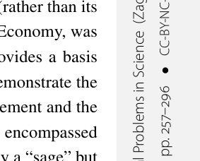
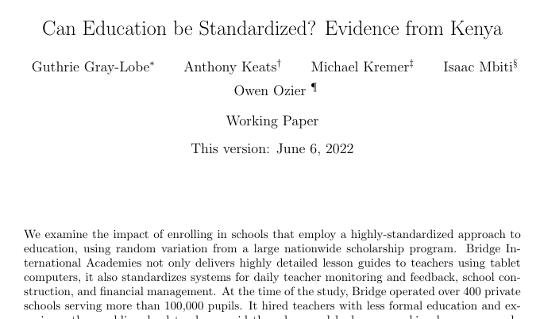
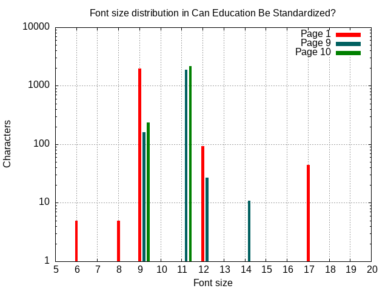
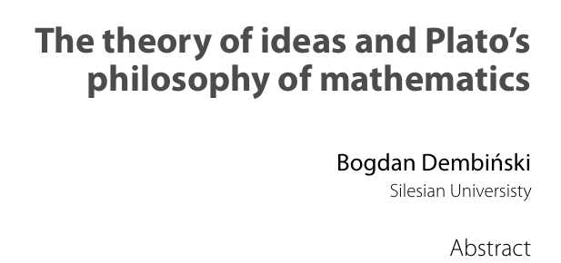
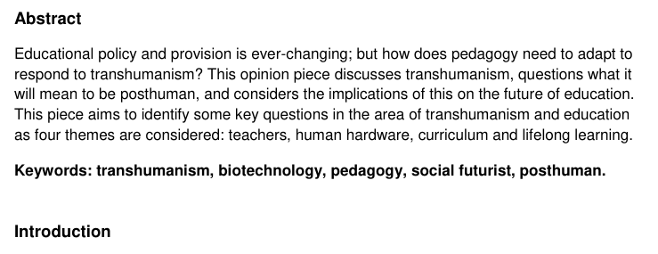
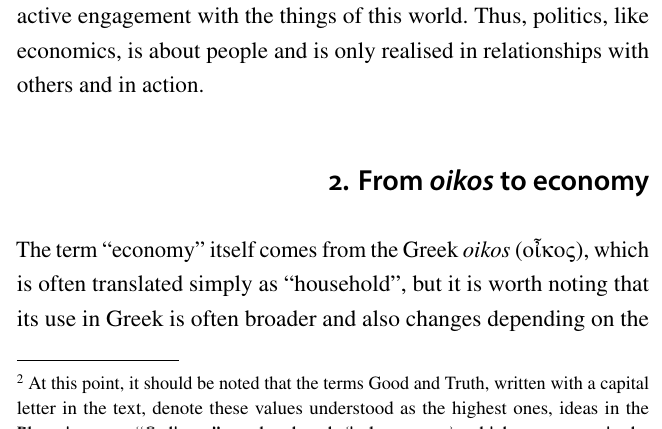
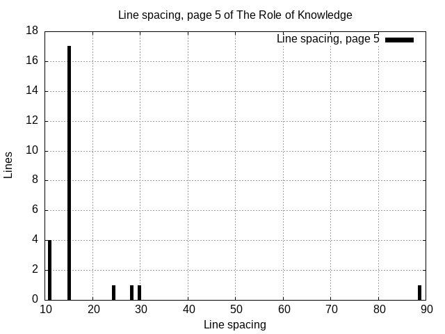

The search engine has recently gained the ability to index the PDF file format.  The change will deploy over a few months.

Extracting text information from PDFs is a significantly bigger challenge than it might seem. 
The crux of the problem is that the file format isn't a text format at all, but a graphical format.

It doesn't have text in the way you might think of it, but more of a mapping of glyphs to coordinates on "paper".  These
glyphs may be rotated, overlap, and appear out of order, with very little semantic information 
attached to them.

You should probably be in awe at the fact that you can open a PDF file in your favorite viewer (or browser), hit ctrl+f, and search for text.

<figure>

<figcaption>
Vertical, rotated text, next to horizontal text.
</figcaption>
</figure>

Meanwhile the search engine preferrably wants clean HTML as input. 

The absolute best way of doing this is these days is likely through a vision based machine learning model, 
but that is an approach that is very far away from scaling to processing hundreds of gigabytes of PDF files 
off a single server with no GPU.

Thankfully this isn't a completely unexplored problem, it was possible to start off with [PDFBox](https://pdfbox.apache.org/)' 
PDFTextStripper class, which *sort of* solves the problem, but with a lot of limitations that means
it isn't quite suitable fo the search engine's needs, as it does as it says on the box, extract the text from a PDF 
with no regards for headings or other semantics, which are incredibly important relevance signals.

While the format does allow some metadata fields including a name, almost nobody seems to populate that field with anything meaningful.

## Identifying headings

A simple way we can look for headings is to seek a semibold or heavier line of text that is isolated from other
text, this works when headings are bolded, but not all headings are bolded!

<figure>

<figcaption>Excerpt of the first page of "Can Education be Standardized? Evidence from Kenya", working version</figcaption>
</figure>

As we see in the example above, many headings instead rely on font size instead.  

This poses a problem, as font-sizes are very much specific to the document itself, one document may have its 
body in 10pt with 16pt headings, another may use 14pt and 20pt instead!  Finding a global breakpoint is futile, 
instead it's more effective to build some font size statistics instead. 

<figure>

<figcaption>Distribution of font sizes in "Can Education be Standardized?"</figcaption>
</figure>

Here page 1 is the front page with an abstract and author listing, page 9 is text with a heading, and page 10 is just text. 
There is some degree of noisiness to the font size  distribution caused by subscripts, footnotes, and so forth.

We can see the distributions of pages 9 and 10 are fairly similar, but page 1 deviates significantly.

Note the logarithmic scale of the y-axis of the graph:  For each page there tends to be one dominant font size, which is generally the body text.

The differences in distribution hints that we may want to use not per-document statistics, but per-page statistics, since particularly the font choices on the first page often deviates from the rest. In the case of "Can education be standardized...", font size 17 is used for the title of the document, but font size 14 is used for headings later on.

Attaching some factor of about 20% to the median font size of the page seems to fairly reliably identify headings.  There are of course always exceptions,
but this catches most of the important cases.

### Joining consecutive headings

Headings are often split into multiple lines, often for stylistic reasons.  This means we sometimes want to join consecutive lines of heading text into one,
and deciding when to perform this operation is not entirely trivial.  I won't provide any real solution to this, but mostly try to highlight why it's a tricky problem.

<figure>

<figcaption>An example of a multiline heading, right justified, followed by additional bolded text.</figcaption>
</figure>

The case above combines a two-line title with the popular aesthetic choice of a heading justified to the right--which casuses problems as indenting a line is also often an indicator of a paragraph break--following the title is another semibolded line of text (the author's name) and some lines down we have a heading that is not bolded at all.

This is another case where we're unlikely to find a fool-proof rule for joining.  Joining consecutive headings with the same font size and weight seems to mostly do a good job, but there are plenty of cases where it produces undesirable results.

<figure>

<figcaption>An example of two unrelated headings following each other with similar font size and weight.</figcaption>
</figure>

## Identifying Paragraphs

PDFTextStripper does a decent job of identifying paragraphs.  It uses a clever mix of looking at line spacing and indentation to figure out when to break a paragraph.  It does have some room for improvement though, particularly with regards to the line spacing logic.

Its biggest problem is that it uses a fixed break point for line separation where above that point, lines are not in the same paragraph, not taking account for the fact that documents use different line spacing.  Especially in academic drafts and preprints, 1.5-2x line spacing is fairly common!  Having a too large value means we interfere with the header identification, as some headers are absorbed into paragraphs of body text, so we need a robust solution here.

We can fix this shortcoming by again applying a similar statistical technique to what we did with font sizes.  Let's consider a page of text, shown below.  This is a text that PDFTextStripper would have dealt with with no greater issues, but it makes for a clearer explanation so we'll consider it anyway.

<figure>

<figcaption>Excerpt of page 5 of "The role of phronesis in knowledge-based economy"; showing four different blocks of text separated by different spaces.</figcaption>
</figure>

If we build a histogram of the distances between lines for this text, we'll find an illustration like below.

<figure>

<figcaption>Distance between lines in page 5 of "The role of phronesis in knowledge-based economy", Ceglarska.</figcaption>
</figure>

We tend to have fairly large outliers here, so using an average approach is unlikely to perform well, the median however ends up being exactly the line distance used in the body.  So again it's possible to tack some factor onto this, and end up with a heuristic for separating paragraphs that will survive any line spacing!

# In Conclusion

Extracting text from a PDF is never going to be perfect, since the format really wasn't designed for that sort of operation, and there are a number of trade-offs when choosing which "good enough"-solution to use.  A search engine is primarily interested in relevance signals, such as headings, it's very happy if it can identify an abstract, and get a somewhat coherent picture of the remaining text.  So in that sense, it's possible to approach a solution that deals with most relevant documents in a somewhat graceful fashion. 

# Sample texts used

<dl>
<dt>Can Education be Standardized? Evidence from Kenya (2022) - Working Paper</dt>
<dd><small>Guthrie Gray-Lobe, Anthony Keats, Michael Kremer, Isaac Mbiti, Owen W. Ozier</small></dd>
<dt>The theory of ideas and Plato’s philosophy of mathematics (2019)</dt>
<dd><small>Dembiński, B.</small></dd>
<dt>The role of phronesis in Knowledge-Based Economy (2024)</dt>
<dd><small>Anna Ceglarska, Cymbranowicz Katarzyna</small></dd>
</dl>
