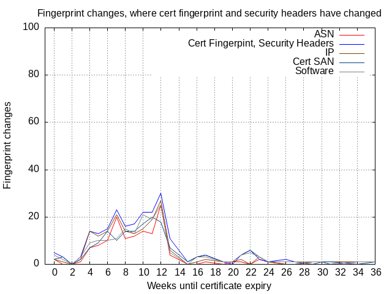

As some of the work planned for Marginalia Search this year has been progressing a bit faster than anticipated, there was time to implement an unplanned change.

This post details the implementation of a system for detecting when servers are online,  to avoid serving dead links and improve data quality, and for detecting when websites have significant changes including ownership transfers and parking.

# Table Of Contents

* [Feature Rationale](#rationale)
* [Data Representation](#repr)
	* [Live Data](#livedata)
	* [Event Data](#eventdata)
* [Change Detection Details](#details)
	* [Availability Detection](#availability)
	* [Ownership Changes](#ownership)
	* [DNS](#dns)
* [Implementation Hurdles](#hurdles)
	* [Scheduling](#scheduling)
	* [Certificate Validation](#certvalid)
* [Conclusions](#conclusion)

<a name="rationale"></a>
# Feature Rationale

Availability detection is useful not just for filtering out dead links in the search results, but for informing the crawler that it should stop trying to reach a dead domain, as well as a host of other things.  Likewise, ownership change detection is relevant to the crawler, which might be informed to do a clean recrawl instead of an incremental one, and could also enter as a factor in domain ranking.

Since misbehaving bots spamming web servers with unwanted requests is a very big and hot issue, and reputation is incredibly important for a small search engine like Marginalia,  the feature is implemented with the design constraint to as best possible only do this with only HEAD requests, normally sent 1-2 times per day per domain; and also DNS queries on a similar interval.

So how much information can you really get from a HEAD request and a DNS query?  It's possible to extract a fairly large number of factors, many of which *weakly* indicate an ownership change, but when taken together paint a fairly lucid picture.

The ownership change detection looks at DNS history, details of the certificate, the security posture of the website, other headers like `X-Powered-By` and `Server`.   One or a few of these changing is normal, but many of them changing at the same time indicates at the very least a major redesign or infrastructure overhaul.

As just about the only thing we do not use to detect changes and uptime is ICMP ping, the name `ping-process` was chosen for the process that is responsible for availability and change monitoring. 

<a name="repr"></a>
# Data Representation


The data is split into two categories of tables, one holding the latest snapshot, and one holding historical events.   


<figure>
<a href="model.png">

</a>
<figcaption>Simplified sketch of the database model</figcaption>
</figure>

<a name="livedata"></a>

## Live Data

One of the first design decision was splitting the table holding current availability information into two.

One table holds basic availability information, such as whether the website is available, error classification, when it was last seen, and so forth.

The other table holds a fingerprint of the website, its certificate, security posture, other headers.  This is a fairly exhaustive fingerprint because it's hard to know beforehand which information will be useful.  The data is still small enough for this to be affordable. 

The argument for this split is that the security information is a very wide column that won't  be populated for any server we can't reach, where we can't find a certificate and we get headers.  

Having a separate column for the security fingerprint also means we don't lose access to the last viable fingerprint if a server becomes temporarily unavailable.    

In many cases we only want to know if the server is up or not; so reading a ton of irrelevant data isn't going to do the performance any favors.  We're only generally interested in full security information when running analytics jobs to identify ownership changes and looking for other patterns, and this will never be done in real time.

DNS information is in a third table because it operates on a different set of domains than http(s)-traffic.  While there is overlap between the set of domains that make sense to try to connect to, and the ones that make sense to `dig`, there are also domains that are in only one of the two sets.

<a name="eventdata"></a>

## Event Data

Change information is stored in separate events tables.  These are treated as effectively immutable, append-only.  This is to cope with the performance implications of the events tables (eventually) growing significantly larger than the live snapshot tables.  

The events tables store a summary of the changes, as well as persisting the full before-and-after state of the information tables as compressed JSON.  This trade-off allows the retention of full historical snapshots, with smaller on-disk storage, while making schema changes somewhat more tolerable as the events tables are likely to grow very large over time.

To avoid having these tables grow forever, they're partitioned by month.  This makes it possible to run a job which exports old data into e.g. parquet or a columnar storage, and then truncating the partitions as-needed.  Unlike DELETE-based flows, this can safely be done while the system is running without long table locks as new data is predictably always inserted into a different partition. 

<a name="details"></a>
# Change Detection Details

The actual availability and change detection is primarily implemented using HTTP HEAD requests.  Not all servers support this, so GET is used as a fallback, along with some schema negotiation that will try HTTP if HTTPS fails. 

Requests are made with a somewhat short 15 second timeout.  This is very much a trade-off between accuracy and not having the process get stuck waiting for minutes on responses that never come.

<a name="availability"></a>

## Availability Detection

For availability detection, which is probably the easiest case, there is still the caveat of transient errors, both server-side, but also on the client network which may be overloaded.

Transient errors are not too interesting to know about, so merely looking at the last ping is not very useful.   To this end, the timestamp of the last successful request, as well as the last failed request, and the number of consecutive errors is kept.  Together, these paint a better picture of the availability of the server. 

In a sample of approximately 1,033,000 records, in an 8 hour window, the availability of the set of domains that were being checked ended up as follows: 

| Status                          | Count   |
| ------------------------------- | ------- |
| Success                         | 777,062 |
| Certificate Invalid<sup>1</sup> | 74,209  |
| Could Not Resolve Host          | 61,140  |
| Server Error                    | 57,395  |
| Timeout                         | 36,242  |
| Client:SocketException          | 15,606  |
| Client:SSLException<sup>1</sup> | 7,118   |
| Client:NoRouteToHostException   | 2,550   |
| Client:NoHttpResponseException  | 2,026   |
| Connection Error                | 1,103   |


<small>
<sup>1</sup>  SSLException is thrown when the platform's SSL/TLS code failed to make sense of what the server was sending, even when ignoring all certificate errors.   'Certificate Invalid' on the other hand is when the custom certificate validator has found a problem, such as incorrect <abbr title="Subject Alternative Name">SAN</abbr> or usage past viable date.</small>

Of the errors reported, 10% were first seen on the last connection attempt and plausibly transient, while 90% were reported for at least two consecutive connection attempts. 

The availability detector tries port 80 if it fails to connect to port 443 (but not if port 443 connects but has errors).   This happened in 1.9% of the samples.
<a name="ownership"></a>

## Ownership Changes

The second class of events that is of interest is identifying ownership changes, major redesigns, domain parking, and similar.   This is much more of a puzzle.  

There are many factors which will change when a domain changes owners, such as its certificate and DNS pointers, but these may also change for other reasons.  Looking at the certificate, it must change when a domain changes owners, but it may also be changed when it is renewed, or replaced for other reasons.  

To give some indication of the predictive power of these indicators, let's plot them against time to expiry.  

We can see some peaks, particularly in Cert Fingerprint at 4 and 12 weeks to expiry.  IP ostensibly follows the other factors, but this is because IP changes alone do not trigger an event generation, so this is almost certainly a spurious correlation.

Peaks like these can be explained either by something like certbot's auto-renewal, or by a large host renewing their certificate, or a website with many subdomains changing.

<figure>
  <a href="renewals.png"></a>
  <figcaption>Changes by Time To Expiry</figcaption>
</figure>

We can filter out some of the peaks by only looking at events where we also see other expected changes.  

<figure>
  <a href="renewals_headers_fp.png"></a>
  <figcaption>Certificate Fingerprint Changes, where security headers also changed</figcaption>
</figure>

Overall requiring two factors that "should" be unrelated to co-occur seems to bring most of the rest of the factors to also line up much more than before.  There is still a tendency toward peaks on certain days, which as mentioned can have several causes, including how major <abbr title="Certificate Authority">CAs</abbr> have begun to issue 90 day (~12 week) certificates.  

Sampling the events where fingerprint, <abbr title="Autonomous System Number">ASN</abbr>, security headers and software has changed, yields a small incidence of about 10-15% of parked domains, but raises an interesting observation.

In the case of parked domains, it seems as they expire, they keep serving traffic, but initially only in plain HTTP.  After a while they gain a Let's Encrypt certificate, and start serving HTTPS as well.  Though this HTTPS->HTTP transition is a very strong signal of a parking event! 

The change detection system would initially flag this as a change of all certificate values, but upon discovering this pattern a new field was added to the security change events specifying how and when there has been a change in schema.

A very simple heuristic that's successfully picking up a large number of domain parking events is:

* Server stopped responding to HTTPS, and now responds to HTTP
* Status Code < 400

<abbr title="Autonomous System Number">ASN</abbr> 16509 (Amazon.com) is also a very strong indicator, which produces 100% parked domains among the sampled data.  You get several "looks" for the parked domain pages from 16509, but a similar setup, leading to the suspicion that it's all the same operation.  


<figure>
<a href="parked-domain.png"></a>
<p></p>
<a href="parked-domain2.png"></a>
<figcaption>Identified Parked Domains from 16509</figcaption>
</figure>


There are of course also parked domains served off other ASNs, but they have a small smattering of false positives mixed in with them. 

Building a model for accurately detecting ownership changes will be more work, and may require additional factors to be really useful, but finding this early success in identifying parked domains is very encouraging!

<a name="dns"></a>

## DNS

The DNS event information needs more analysis, but a short summary of the changes seen in 8,975,010 samples is provided:

| Pointer | Change Count |
| ------- | ------------ |
| A       | 4,122,404    |
| AAAA    | 661,785      |
| CNAME   | 8,048        |
| NS      | 2,971,543    |
| MX      | 2,656,984    |
| CAA     | 203,408      |
| TXT     | 1,468,475    |

It is unlikely these events will say very much on their own, the hope is they may help add context to the other events gathered. 
<a name="hurdles"></a>
# Implementation Hurdles

<a name="#scheduling"></a>

## Scheduling

Initially the design used the SQL database to do all its job scheduling via a timestamp column.  This ended up causing resource contention and performance issues.  The hope was that the amount of data was small enough for this design to work, but ultimately it did not, and the job scheduling was mirrored in RAM as well. 

Another problem any crawler-adjacent process will run into is scheduling the retrievals in a way that takes into consideration per-domain limits.  If you do not limit the number of concurrent requests to a subdomain by its top domain, you will find yourself rate limited very quickly, and if you keep at it, also with a bad IP reputation.

This is complicated by the fact that the number of subdomains per domain follows a pareto distribution, where on the one hand, there are many millions of domains with only one subdomain, but also a handful with up to a million subdomains.

While the change detection currently only runs on a subset of about 2 million domains, the crawler is aware of approximately 36,000,000 domains in total, and about 1,500,000 of those are subdomains of `tumblr.com`.  

This leads to a pitfall where it's easy for all but one thread to get stuck waiting for permission to visit domains from one large blogging platform.  

There are two decent workarounds to this:

1.  Have a separate queue and dedicated execution threads for the whale domains.  The difficulty with this is figuring out ahead of time for which domains to spin up separate threads and queues.  Hard-coding is an option, but adds maintenance and monitoring work.  

2.  Use some mechanism to identify when a domain is blocking, and skip jobs from that domain until it is available.  This is easier to implement but leads to a fair bit of queue churn, but will resolve thread starvation scenarios both for large outliers and for unlucky scenarios where smaller domains end up causing a block.

In this case approach 2 was chosen, as relatively few threads are involved, and (in-memory) queue churn ends up being tolerable. 

<a name="certvalid"></a>

## Certificate Validation

Another obstacle has been finding a good balance between correctness and sanity when implementing the code that validates HTTPS certificates.

This code is often hidden away, which is generally a good thing as it's a fractal of pitfalls and weird caveats.  

As the point of this exercise in this is at no point any form of secure communication, more so to get a feel for the health of the server, the SSL/TLS validation code is very lenient.  

The basic questions the system is attempting to answer are the following:

*  Is the chain valid? (ish)
*  Has it expired?
*  Is the host name valid for the certificate?

Though there are still significant challenges.   

Even while the validator implemented here performs very rudimentary checks, it still manages to struggle with being at the same time both more and less strict than browser implementations.

Probably the biggest headache is that a lot of servers simply send the wrong certificates.  

Apparently something like 10% of servers suffer from a category of errors where they do not send a correct certificate chain, particularly they pass along the wrong intermediate or root certificate for the leaf certificate.

What this looks like in practice is like this.  Note that the certificates being validated and the certificate chain below are not the same!

```
$ openssl s_client -connect www.thecavalierclub.co.uk:443 -showcerts
Connecting to 85.233.160.140
CONNECTED(00000003)
depth=2 C=GB, O=Sectigo Limited, CN=Sectigo Public Server Authentication Root R46
verify return:1
depth=1 C=GB, O=Sectigo Limited, CN=Sectigo Public Server Authentication CA DV R36
verify return:1
depth=0 CN=www.thecavalierclub.co.uk
verify return:1

...

Certificate chain
 0 s:CN=www.thecavalierclub.co.uk
   i:C=GB, O=Sectigo Limited, CN=Sectigo Public Server Authentication CA DV R36
   a:PKEY: RSA, 2048 (bit); sigalg: sha384WithRSAEncryption
   v:NotBefore: Jun 10 00:00:00 2025 GMT; NotAfter: Jun 10 23:59:59 2026 GMT

1 s:C=US, ST=New Jersey, L=Jersey City, O=The USERTRUST Network, CN=USERTrust RSA Certification Authority
   i:C=US, ST=New Jersey, L=Jersey City, O=The USERTRUST Network, CN=USERTrust RSA Certification Authority
   a:PKEY: RSA, 4096 (bit); sigalg: sha384WithRSAEncryption
   v:NotBefore: Feb  1 00:00:00 2010 GMT; NotAfter: Jan 18 23:59:59 2038 GMT

2 s:C=GB, O=Sectigo Limited, CN=Sectigo Public Server Authentication CA DV R36
   i:C=GB, O=Sectigo Limited, CN=Sectigo Public Server Authentication Root R46
   a:PKEY: RSA, 3072 (bit); sigalg: sha384WithRSAEncryption
   v:NotBefore: Mar 22 00:00:00 2021 GMT; NotAfter: Mar 21 23:59:59 2036 GMT
```


To work around this, something called AIA Fetching is often used to transparently fix the misconfiguration, where the client goes and downloads the missing certificates from the web.  


<figure>
<a href="aia-fetching.png"></a>
<figcaption>AIA Fetching Workflow:  Client fetches missing certs and discards irrelevant ones</figcaption>
</figure>

(A bit of a tangent, but between this, and the glacial implementation rate of particularly [ECH](https://en.wikipedia.org/wiki/Server_Name_Indication#Encrypted_Client_Hello) but also to some extent [OCSP stapling](https://en.wikipedia.org/wiki/OCSP_stapling):  For a protocol that's ostensibly supposed to make your traffic secret from onlookers, TLS sure does leak a lot of information about where you're going, and for some reason there doesn't seem to be much of a hurry to change that.)

AIA fetching is possible to implement, and doing this reduced the number of errors somewhat, but still not to a degree where the validator is in perfect agreement with how a browser operates -- almost all of the certificate chain errors still ended up being false positives.

Ultimately the validity ambition was backpedaled even further, and now only properly checks host name against SAN and expiry against the wall clock, with an indicative flag "could we verify the chain" that is not regarded as an error when it is set to false.   

This is mostly a trade-off based on the data.  It's exceptionally rare to see a fully self-signed certificate chain of a length longer than 1.  So settling for checking only for common errors, and dismissing chain validation errors as probably being down to missing or invalid intermediary certificates seems to produce validation results that agree with a browser's opinions the most.


<a name="conclusion"></a>
# Conclusions

This has been fairly finicky work.  

In large, this is how anything crawler-adjacent tends to be:  The web is a patchwork of standards, on top of that is the way things actually work (which may or may not overlap with the standards), and then there are three decades of workarounds and patches on top of that to make things somewhat hold together.  It is chaotic and never fails to throw unexpected curve balls your way.

That said, the new system mostly works.  The early success identifying domain parking, and overall the accuracy of the liveness information is encouraging.   The liveness data is already incorporated in the random exploration feature in the search engine, and will work its way into various other features in the upcoming future.   

Particularly the crawler could probably draw useful benefit of this new dataset, in making informed decisions about when to stop crawling a domain that hasn't been reachable for a long time (possibly archiving the existing crawl data?), in making informed decisions about when to do an incremental re-crawl versus wiping the slate clean and starting over, and so on.

Beyond that, the events tables need to populate a bit more before doing more with the data.  Right now the sample size is still a bit too small.  Given a few months of data, it should be possible to find a more confident baseline, and build better models for usefully detecting significant changes.
