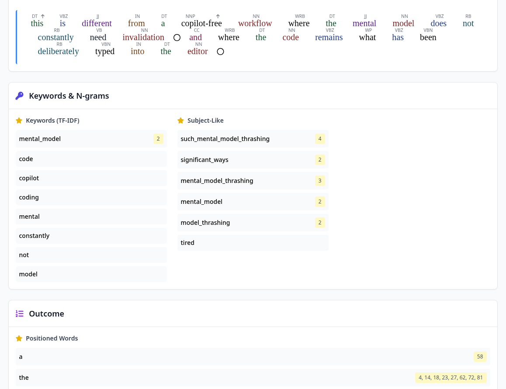

One of the big ambitions for the search engine this year has been to enable searching in more languages than English, and a pilot project for this has just been completed, allowing experimental support for German, French and Swedish.  

These changes are now live for testing, but with an extremely small corpus of documents.

As the search engine has been up to this point built with English in mind, some anglo-centric assumptions made it into its code.  A lot of the research on search engines generally seems to embed similar assumptions.

As this is a domain rife with unknown unknowns, the ambition for this pilot was to implement support for just a few additional languages in order to get a feel for how much work would be required to support more languages in general, as well as to assess how much the index grows when this is done.

Though it was fully understood upfront that supporting *all* languages in one go is unrealistic, as some languages are more different than others and require significant additional work.  Human language is surprisingly disparate. 

A language like Japanese, for example, has not only multiple alphabets, but [embeds character width in unicode](https://en.wikipedia.org/wiki/Halfwidth_and_fullwidth_forms); on top of that the language doesn't put spaces between words.  As such the language requires special normalization.

Latin, on the other hand, has [dozens](https://dcc.dickinson.edu/grammar/latin/1st-and-2nd-declension-adjectives-%C4%81-o-stems) [of](https://dcc.dickinson.edu/grammar/latin/2nd-declension-stem-paradigm-and-gender) [forms](https://dcc.dickinson.edu/grammar/latin/1st-conjugation) for each word, and the words can often be reordered without significantly changing the meaning of a sentence.  On the one hand this makes the grammatical analysis of the language somewhat easier since the words announce their function in the sentence fairly unambiguously, but on the other you probably need to store the text in a lemmatized form, and then strongly de-prioritize word order when matching.

Google's bungled handling of Russian was supposedly why Yandex was able to eke out a foothold in that market.

## What needs changing

The search engine's language processing chain is fairly long, but the most salient parts go something like this: 

* Text is extracted from the HTML
* Language is identified using fasttext
* Text is broken into sentences
* Words are lowercased and Unicode is normalized
* Sentences are stemmed and POS-tagged 
* Sentences, with stemming and POS-tag data is fed into keyword extraction algorithms
  * Keywords are mapped to positions and HTML tags
  * Important keywords are identified using TF-IDF (using stemmed forms)
  * Important keywords are identified using grammar patterns (POS-tags)
  * Important keywords are identified using other heuristics
* Keywords are hashed

Stemming is an imperfect way of getting a base form of a word, though generally such algorithms have a great number of flaws, so that e.g. universe and university seem to be the same word.  This is only used in tf-idf calculations.

Part-of-Speech (POS) tagging is a grammatical annotation process where the role of each word is as best possible identified.  This helps identify named entities, subjects, and so on. 

Both of these processes needless to say require some awareness of the language being acted upon.

These "important keywords" are used to assign documents to a special index that helps with recall by ensuring these documents are included in the set that is ranked before the execution timer runs out. This is not strictly necessary, and in some cases such as where POS-tagging is not possible, can be disabled, partially or as a whole.

The normalization step is subject to cultural differences that do not translate.  In English you'd probably expect to find the metal band Tröjan, typing "trojan".  In Swedish these are different letters entirely that should not match, the former means "the shirt", the latter "trojan" in the Homeric or IT-security sense.  Though a Swedish person would likely also say that they should be able to find mü(e)sli with the keyword "musli", but a German-speaker would disagree and say that u and ü are clearly not the same. 

There also exists a bootstrapping problem, as the statistical model used to calculate TF-IDF is based on documents in the index.  Since almost all of the documents in the index up until this point have been in English, term frequencies for the newly added languages are missing.  This breaks TF-IDF, as used in identifying important keywords, until a new model can be constructed.  Thankfully the BM-25 model used in ranking is robust to this, as it relies on live data from the index itself.

The basic approach to parametrize language handling selected was to inject a language definition object, from which language appropriate logic is accessible.

This is configurable [via XML](https://github.com/MarginaliaSearch/MarginaliaSearch/blob/master/code/functions/language-processing/resources/languages-experimental.xml). Here XML was chosen because it arguably has the best built-in validation support, making it a fantastic use case for a self-contained configuration file like this one, where late validation would be very annoying to deal with. 

Much of the configuration file consists of various grammatical patterns used to identify important keywords based on the role of a word in a sentence.

```xml
<ngrams type="noun">
    <pospattern>VBG</pospattern>
    <pospattern>RB VBG</pospattern>
    <pospattern>(NNP* JJ)</pospattern>
    <pospattern>(NN* JJ) NN*</pospattern>
    <pospattern>(NN* JJ) (NN* JJ) NN*</pospattern>
    <pospattern>(NN* JJ) (NN* JJ) (NN* JJ) NN*</pospattern>
    <pospattern>(NNP* JJ) (NNP* IN TO CC) NNP*</pospattern>
    <pospattern>(NNP* JJ) (NNP* IN TO CC) DT NNP*</pospattern>
    <pospattern>(NNP* JJ) (NNP* IN TO CC) (NNP* IN TO CC) NNP*</pospattern>
</ngrams>
```

An expression like `(NN* JJ) (NN* JJ) NN*` is interpreted as 

1. Any tag starting with `NN`, or the tag `JJ`
2. Any tag starting with `NN`, or the tag `JJ`
3. Any tag starting with `NN`

Previously these patterns were hard coded, and finding a performant alternative implementation took some effort.  A bit mask approach was selected, as it allows for some very basic bit-level concurrency that drastically reduces the number of branches needed.

As far as grammatical analysis goes, the approach used by the search engine is pretty medieval, but it does do a fairly good job at what it sets out to do, and as a result, one thing it is generally pretty good at is finding websites about some topic.  

In some ways the imperfections introduced by the old-fashioned way of approaching language processing is almost helpful in bringing in more relevant results, as they tend to capture more variations of the words related to the topic of the document.

There are more places that need minor language dependent behavior changes that are glossed over here, both in the language processing pipeline discussed above, and in the query parser, though in the interest of keeping this update from becoming an overly verbose git diff, these will be glossed over.

### Tooling

To help make sense of this, a test tool was built that runs the language processing pipeline in isolation, and outputs annotated intermediate results for human inspection.

<figure>
    <a href="tool.png"></a>
    <figcaption>Language Processing Tool illustrating some problems with keyword identification when run on a very short sample of text.</figcaption>
</figure>


Work in this domain poses special problems that all but demand human testing.  Machine testing can be good for catching regressions or getting access to some code for easier debugging, but natural language has so many nuances that any test suite is woefully inadequate compared to a pair of human eyeballs.

It has already helped refine the algorithms used to identify important keywords in English, which wasn't the intent of building the tool, but its immediate consequence.

## Integration

Integrating the new multi-language search data into the system poses some design considerations.  

One option would be to stick everything in one big index, and then filter results based on language during or after ranking.  The strength of this is that it becomes possible to search in any language without specifying it upfront.  

The drawbacks of the one-index approach is that it grows the index, which makes all queries slower; it also grows the number of keywords in the lexicon, which is something that we generally want to avoid.

The way the search engine handles mapping keywords to numeric ids is to use a hash algorithm.  Not a hash table, but the output of the hash algorithm itself.  This seems absolutely unhinged at first glance, but works remarkably well as long as the lexicon stays small enough.  

Hash collisions do happen on rare occasions, but they need to happen between words where the words actually appear in the same documents to be a problem, generally leading to the ranking algorithm having to trudge through irrelevant documents and performing worse as a result of wasting its time budget.

Massively expanding the lexicon like we would if we were to mingle the documents increases the likelihood there will be an actual problem arising from these rare false positives.

If we stick every keyword from every language in the same index, a different problem arises, namely that homophones exist across different languages, meaning that the index lookup needs to wade through irrelevant documents that are trivially unrelated to the query.  

The words `salt` and `lag`, if they appear in the same document in English likely selects documents relating to esports, whereas in Swedish they select for documents relating to food preservation.

The alternative option is to separate the indexes.

The drawback here is that you must specify the language upfront, and querying in all languages becomes very expensive, as it executing multiple queries, though the desired language of the search results are generally known beforehand so this is a relatively small concern that, at best, affects a small number of machine-access use cases.

Since it has far fewer problems, and promises to be faster and more accurate, this approach was selected.

In practice this was implemented as language-specific keyword-document mappings, that point into a common file containing document lists.

Initially the indexes were constructed from a common journal file, which was consumed repeatedly, but this turned out to be slow, and a partitioned approach was selected instead, with one journal per language.  This almost completely removes any overhead.

## Outcome

The changes discussed above have been implemented, and upon evaluation seems to work reasonably well, though evaluation has somewhat run into a dead end, as the index itself is **extremely** small for the newly added languages.

The experience of small index is devious as it may just mean poor recall, though looking at the documents database for one index partition, this is about 12% of the index, it really is quite small!

| iso  | document count |
| ---- | -------------- |
| en   | 112,846,397    |
| de   | 7,623,983      |
| fr   | 4,852,759      |
| sv   | 1,020,962      |

To verify this is not due some silent, catastrophic processing error, the proportions were compared against the number of documents found in the 50 GB document sample used in testing, using a simplified process that only does language identification.

| iso  | document count |
| ---- | -------------- |
| en   | 11,497,571     |
| de   | 614,311        |
| fr   | 409,877        |
| es   | 267,408        |
| ja   | 217,599        |
| nl   | 196,130        |
| ...  | ...            |
| sv   | 67,670         |

The proportions aren't identical, but in the same general ballpark.  The small size of the sample, along with the uneven distribution and apparent rarity of these documents adequately explains the disparity.

The lack of documents in languages other than English is likely due to how the index has been grown, by following and adding links from English websites.  These occasionally lead to bilingual websites, and on rare occasions to websites completely in a different language, though it seems reasonable most websites that are not at least partially in English sees few or no links from English-language websites.

Adding to the problem, up until fairly recently the index wasn't really growing very much at all, only through manual submissions.  

Beyond a certain point, meaningfully growing the index by just following links became difficult.  

Most known domains are dead, so merely adding more domains to the list of websites to crawl only serves to pollute the database with junk data.

In order to get around this, and reach the goal of indexing a billion documents, a new process was built to visit candidate websites to verify that they are in fact real and on-line, before assigning them to an index partition.  

The process has been running for almost a quarter, and has managed to identify about 800,000 viable new domains in that time window. (This has brought the document total up to 969M documents.  So very nearly there now!) 

Web search is unusual in how often you run into these extremely long running processes that need to cook for months, sometimes up to a year before they really begin to pay off.  

We'll have to see whether building this new process was so prescient it ends up being sufficient to identify and add new domains in more languages, as links from the newly processed Swedish, French and German websites have been added to the domain database, or if some sort of manual seeding or targeted selection process is needed.  

It seems plausible it will at least begin to remedy the data starvation, as the rate of successful domain discovery has shot up significantly since processing links from the documents processed in the newly added languages, and many of the new domains are indeed from `.de`, `.se`, `.fr`, and `.ch` domains.

For now we'll have to wait and see how the data-set evolves.  It is difficult to further refine the multi-language aspect of the search data with a data-set this small.
