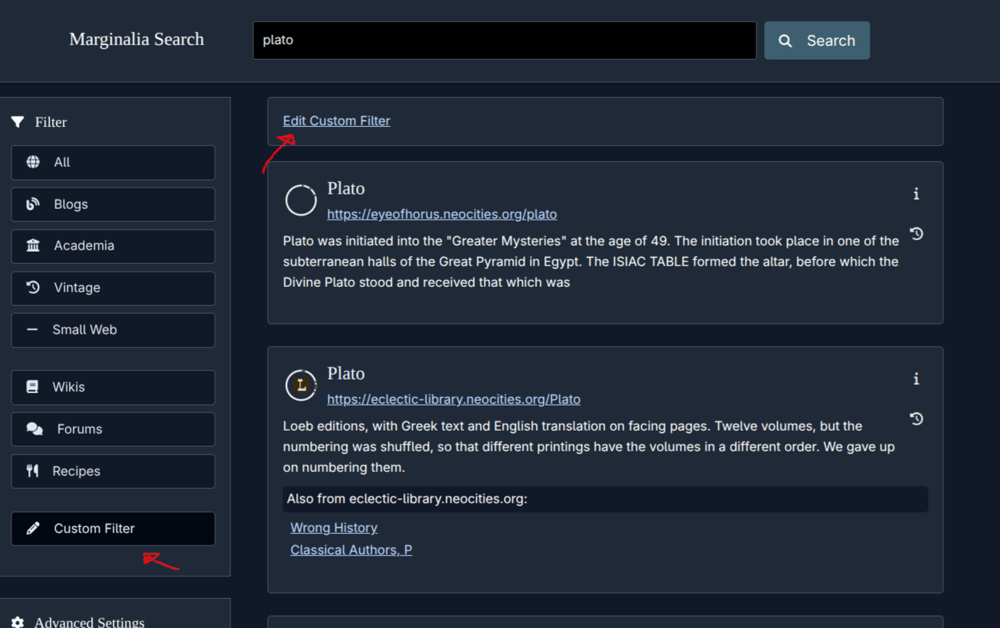
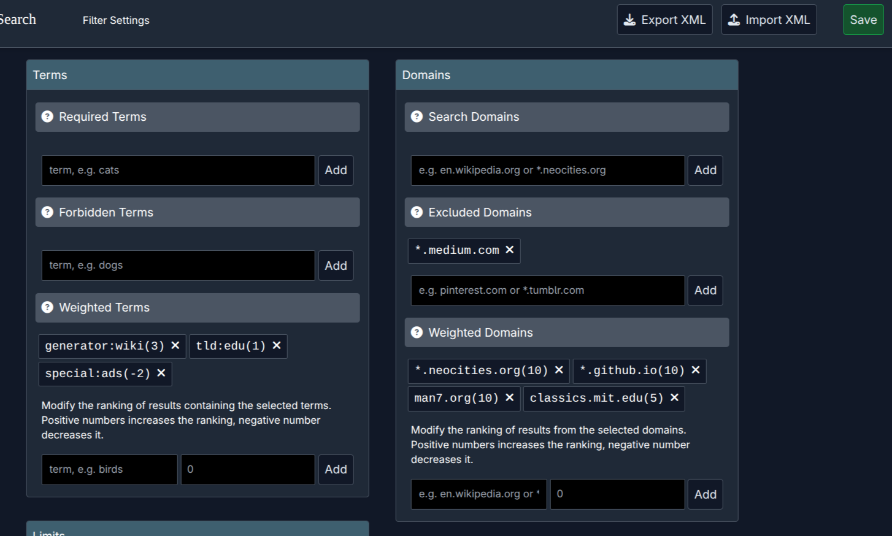

The search engine recently exposed a fair number of new tools for custom filtering to the API consumers and users of the new UI.

This was originally going to be an incredibly chaotic update, both annuncing the new features and doing a technical walkthrough of the changes but that ambition turned out a bit *too* chaotic, so let's split them up and focus on the feature announcement bit today.

## New Search Filtering GUI

It's now possible to define a custom filter in the GUI, on the `marginalia-search.com` version of the website! 

<figure>
<a href="filters2.png"></a>
<figcaption>Custom Filters</figcaption>
</figure>

<figure>
<a href="filters.png"></a>
<figcaption>New Filter Editor</figcaption>
</figure>

The new filters allow configuring the ranking to promote certain domains, or terms, and a few other parameters.

These filters are stored in local storage, and only injected when doing custom filter searches. 

This design is a bit more awkward than going the route of having accounts and remote storage, 
but offers better privacy, as the client will only send the filter data when it is needed (i.e. when doing a custom search),
rather than always providing an identification cookie.

To make the custom filters a bit less ephemeral, these filters can be exported and imported from XML;
and this new XML format can also be imported into the public API endpoint if anyone wants to for example
set up a search engine for their website, or a small community.

Note: There are a few areas that are still getting some polish, especially the filter editor which is a bit underdocumented
and a bit wonky on mobile interfaces, but that should be fixed up soon!

## New Public API

Along with the UI changes, a new version of the public API has been released, addressing some design issues with the original API which was designed with literally 4 minutes of thought put into it after someone sent an email requesting an API very early into the development of the search engine. 

The original API will remain online and you need to do nothing to keep using it, but it will not receive new functionality so migrating to the new API is recommended.

The breaking change of the new API is that the API key is sent as a header, rather than a path parameter; and the query is sent as a query parameter.

Old API:
```bash
$ curl "https://api.marginalia-search.com/${API_KEY}/search/${QUERY}"
```

New API:
```bash
$ curl -H"API-Key: ${API_KEY}" \
        "https://api2.marginalia-search.com/search?query=${QUERY}"
# note the new subdomain!
```

As always, you can get a non-commercial API key for free by emailing me.  The email step is mostly to prevent mass automatic signups,
I have been handing out keys for years and never turned anyone down.

### Short Demo

Perform a query:
```bash
$ curl -H"API-Key: ${API_KEY}" https://api2.marginalia-search.com/search?query=plato
(... results in json ...)
```

Define a filter.  Here we're uploading the XML from the filter editor GUI seen in the start of the post.
You can of course write the XML by hand as well.

```bash
$ curl -H "API-Key: ${API_KEY}" -XPOST \
       -H "Content-Type: text/xml" \
       -d @marginalia-filter-25-12-08_140241.xml\
       "https://api2.marginalia-search.com/filter/my-filter"
```

Query filters:

```bash
$ curl -H"API-Key: ${API_KEY}" "https://api2.marginalia-search.com/filter"
[ my-filter ]
```

Perform a search using a custom filter:

```bash
$ curl -H"API-Key: ${API_KEY}" \
  "https://api2.marginalia-search.com/search?query=plato&filter=my-filter"
(... results in json ...)
```

Export filter definition:

```bash
$ curl -H"API-Key: ${API_KEY}" "https://api2.marginalia-search.com/filter"
<?xml version="1.0"?>
<filter>
	<terms-promote amount="3.0">generator:wiki</terms-promote>
	<terms-promote amount="1.0">tld:edu</terms-promote>
	<terms-promote amount="-2.0">special:ads</terms-promote>
	<domains-exclude>
		*.medium.com
	</domains-exclude>
	<domains-promote amount="10.0">*.neocities.org</domains-promote>
	<domains-promote amount="10.0">*.github.io</domains-promote>
	<domains-promote amount="10.0">man7.org</domains-promote>
	<domains-promote amount="5.0">classics.mit.edu</domains-promote>
	<limit param="year" type="gt" value="2009" />
</filter>
```

Delete a filter

```bash
$ curl -H"API-Key: ${API_KEY}" -XDELETE "https://api2.marginalia-search.com/filter"
```

## Filter XML Format Reference

Below is an example of the XML format that's used to define the filters.  

It seems every search engine that supports custom filters is doing their own thing, and there's often a bit too much custom functionality to arrive at One True Format, so the compromise is to go for boring-and-portable XML to make it maximally portable.

```xml
<?xml version="1.0"?>
<filter>
    <domains-include>
        www.google.com
        *.youtube.com
    </domains-include>

    <domains-exclude>
        www.yandex.ru
    </domains-exclude>

    <domains-promote amount="-1.0">
        www.bing.com
        www.yahoo.com
    </domains-promote>

    <!-- Adjust ranking of these terms -->
    <domains-promote amount="1.0">
        www.mojeek.com
    </domains-promote>

    <temporal-bias>OLD</temporal-bias> <!-- or RECENT, or NONE -->

    <terms-require>
        foo
        bar
    </terms-require>

    <terms-exclude>
        baz
    </terms-exclude>

    <!-- Adjust ranking of these terms -->
    <terms-promote amount="5.0">
        quux
    </terms-promote>

    <!-- estimated publication year (janky) -->
    <limit param="year" type="lt" value="1996" />
    <!-- a measure of how much javascript is on the page, 
         legacy marginalia search ranking metric -->
    <limit param="quality" type="eq" value="5" />
    <!-- how many documents are on the domain -->
    <limit param="size" type="gt" value="100" />
    <!-- pagerank, 0-255 -->
    <limit param="rank" type="gt" value="20" />
</filter>
```

## What's next?

There's still a bit more polish I'd like to give this feature, and the search engine is also being migrated off docker some time
soon to address some network jank that has been intermittently haunting the search engine.  Several technical write-ups are in the pipe as well, on this change, and the joys of replicating docker networking outside of docker.

