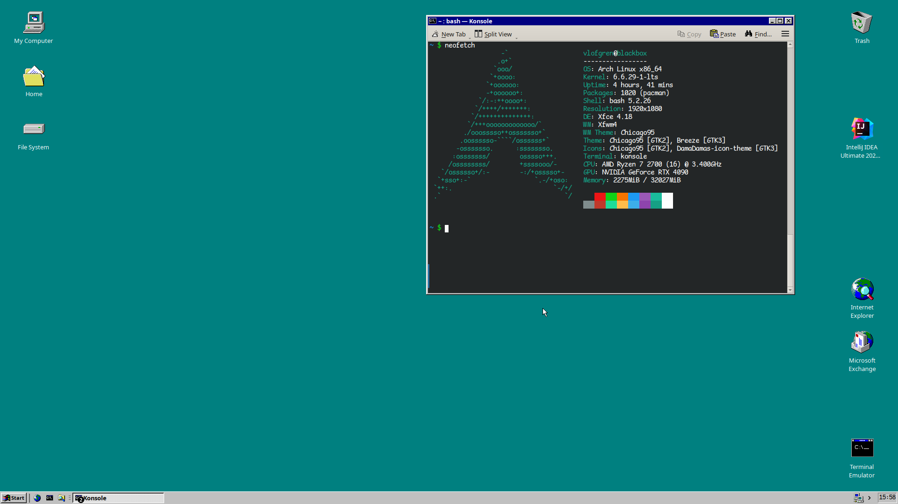

Linux distribution is Arch.  Been bouncing between Debian, Debian-likes (was on Pop! for a long while), Slackware, and recently Gentoo.  What I'd really like is Arch with OpenRC but that sadly isn't a thing as far as I'm aware.

Window manager is XFCE4 with the Chicago95 theme.  KDE-stuff has the reactionary theme.  It's not a perfect fit, but it's close enough that it doesn't grate the senses too much.  More visually consistent than most other desktop environments, even actual (2020s) Windows.

Windows 95 is the peak of interface design.  If you turn away from skeumorphism, you turn away from humanity.  All human language is metaphorical, even design language. Heck, especially design language.

<figure>

<figcaption>Screenshot</figcaption>
</figure>

Monospace terminal/editor font is *Comic Mono*, the excellent readability of which is real MVP in covering for my dyslexic ass.

Console is *Konsole*, terminal is *Bash*.  For editors I switch between vanilla completely uncustomized vim, kate, or intellij.

Keyboard is a *Logickeyboard Silver Slimline Keyboard*, which is the closest I've come to replicating the feel of a Logitech Ultra X, the greatest keyboard there ever was (despite having scissor switches), which in turn is the closest thing you'll get to a full sized desktop keyboard that feels like the keyboard of an older IBM-style ThinkPad.

Mouse is some wireless garbage.  I alternate between this and a decade old "gaming" mouse with awful precision and a busted scrollwheel.
