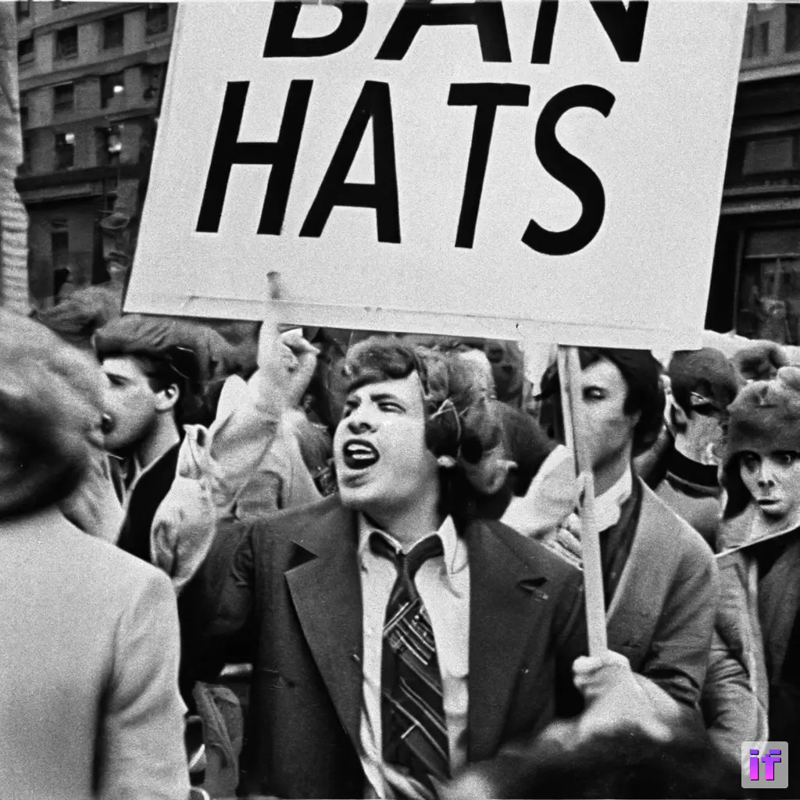
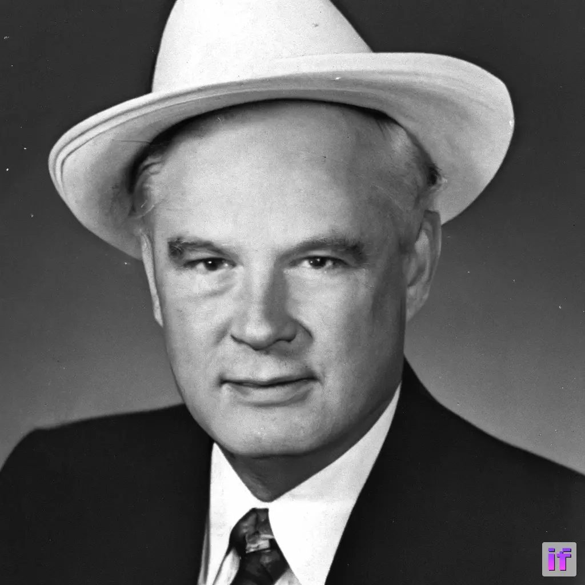
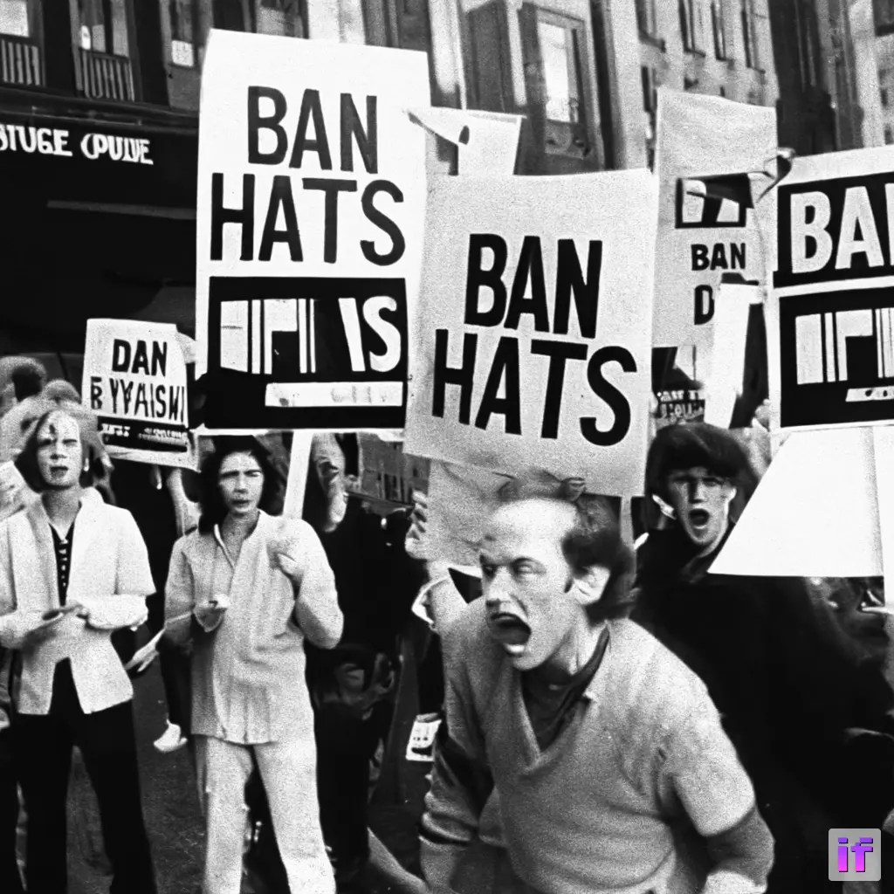
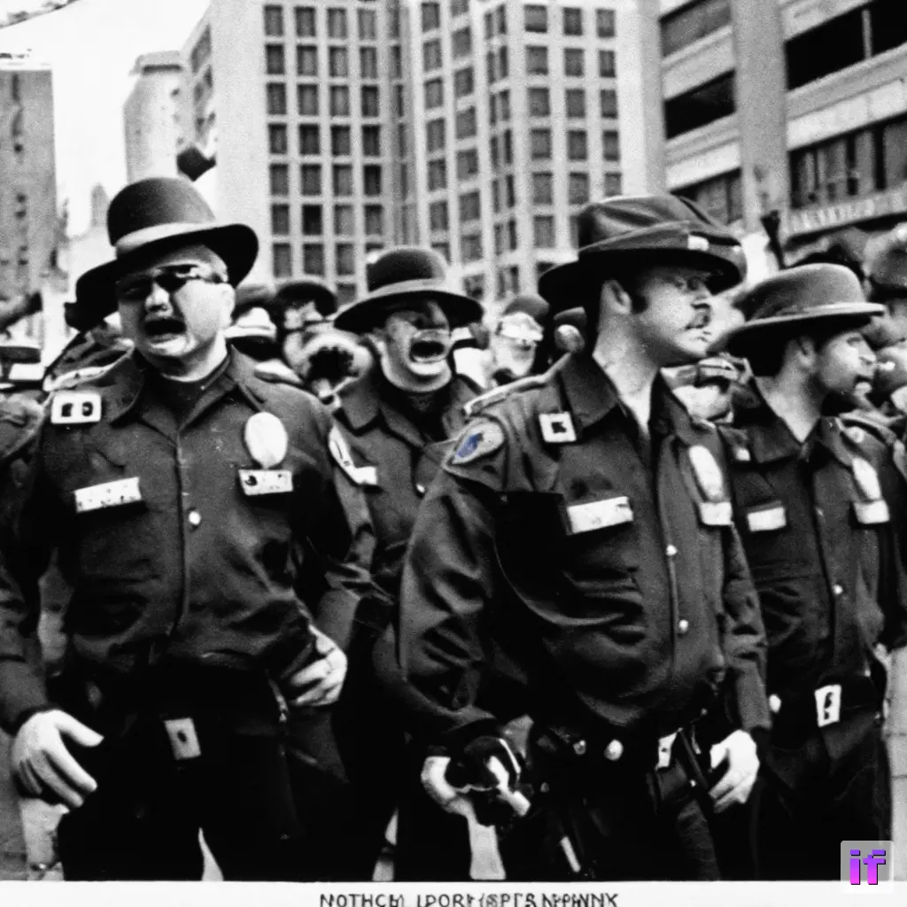
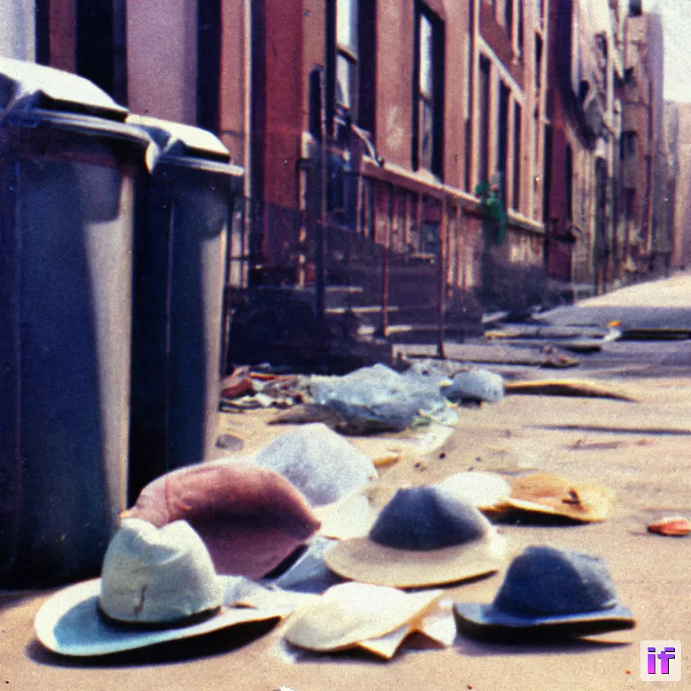

+++
title = "The Anti-Hat Riots of 1973"
draft = false
date = "1973-04-20"
tags = ["ai"]
+++
  

Disclaimer: Many will argue this never happened. I wasn't there so I wouldn't know.

<h1>The Anti-Hat Riots of 1973</h1>
<figure>
  
  <figcaption>The third day of protests</figcaption>
</figure>

The <b>Anti-Hat Riots of 1973</b> were a series of violent protests that erupted in several major cities across the United States, primarily on the East Coast, in response to a proposed law that would have made it mandatory for men to wear hats in public. The riots lasted for several weeks and resulted in widespread damage to property and numerous injuries.

<h2>Background</h2>

The proposed hat law was put forward by a group of conservative lawmakers who believed that men had become too casual in their dress and that wearing a hat in public was a sign of respectability and tradition. The proposed law stated that all men over the age of 18 would be required to wear a hat in public, with a fine imposed on those who failed to comply.

<figure>
  
  <figcaption>Sen. Hatter</figcaption>
</figure>
<h3>The pro-hat movement</h3>

During the 1970s, the pro-hat movement consisted of individuals who believed that hats were an important part of traditional dress and etiquette. They saw the trend away from wearing hats as a sign of disrespect for cultural traditions and a decline in social decorum.

Some proponents of the pro-hat movement believed that hats were necessary to maintain a professional appearance, particularly in the workplace. They saw the abandonment of hats as a symptom of a larger cultural shift away from formality and professionalism.

Others argued that hats were a sign of masculinity and represented a sense of pride in one's appearance. They saw the anti-hat movement as an attack on traditional gender roles and a rejection of traditional masculine ideals.

<h2>Protests</h2>
<figure>
  
  <figcaption>Protests spread to London</figcaption>
</figure>

The proposed law was met with immediate opposition from various civil rights and anti-establishment groups, who saw it as an infringement on personal freedom and a form of patriarchal control. The protests began in New York City, with thousands of people taking to the streets to voice their opposition to the proposed law.

The protests quickly turned violent, with clashes breaking out between protestors and police. Rioters set fire to cars and buildings, looted stores, and attacked anyone wearing a hat. The violence quickly spread to other major cities, including Boston, Philadelphia, and Washington D.C.

Culturally, the riots reflected a growing trend towards individualism and self-expression, particularly among younger generations. Many of the protestors saw the proposed hat law as a symbol of the old-fashioned, patriarchal values of the past and an attempt to stifle their freedom of expression.

The riots reflected a broader dissatisfaction with the government and its perceived overreach. Many protestors saw the proposed law as an example of government interference in personal choices and a violation of individual rights.

Economically, the riots may have been fueled by underlying tensions related to income inequality and class differences. The hat law was seen by many as an attempt by wealthy elites to impose their values on the general population, and the riots were in part a response to this perceived injustice.

<h2>Government response</h2>
<figure>
  
  <figcaption>Police response to the "anti-hat agitators" </figcaption>
</figure>

The initial response to the riots was to call in the National Guard to restore order, and a curfew was imposed in many affected areas. However, the presence of armed troops and the restriction of movement angered many protestors, who saw the response as an infringement on their rights.

In the aftermath of the riots, civil rights groups criticized the government's response, arguing that it was an example of excessive use of force and a violation of the First Amendment right to free speech. Some also pointed out that the proposed hat law was discriminatory, as it only applied to men, and argued that the government's response was a reflection of broader societal biases against certain groups.

Despite these criticisms, the government did not formally apologize for its handling of the riots, and the incident remains a contentious issue in discussions of civil rights and free speech in the United States.

The riots received widespread media coverage, and pressure mounted on the government to abandon the proposed law. After several weeks of violence, the law was officially withdrawn, and the riots came to an end.

<h2>Aftermath</h2>

The Anti-Hat Riots of 1973 had a significant impact on American society, sparking debates about personal freedom, government control, and the role of fashion in society. The riots also had a lasting impact on the fashion industry, with many men choosing to forgo hats altogether in the years that followed.

Today, the Anti-Hat Riots of 1973 are remembered as a pivotal moment in the history of American fashion and civil rights, and serve as a cautionary tale about the dangers of government overreach and the importance of individual freedom.

<h3>The decline of haberdashery</h3>
<figure>
  
  <figcaption> Many former hat-wearers discarded their hats after the conflict </figcaption>
</figure>

The haberdashery industry was negatively affected by the Anti-Hat Riots of 1973. The proposed hat law had been supported by many traditionalists and conservatives, who saw hats as an important part of men's dress and a sign of respectability. If the law had been enacted, it could have led to a significant increase in demand for hats.

The riots and subsequent abandonment of the law had the opposite effect. Many men who previously wore hats stopped doing so out of fear of being attacked or associated with the controversy surrounding the law. This trend continued even after the riots ended, with many men choosing to forgo hats altogether in the years that followed. This decline in demand for hats likely had a negative impact on the haberdashery industry, which would have seen a reduction in sales as a result.

The riots and negative media coverage associated with the proposed law damaged the reputation of the haberdashery industry and made it less appealing to younger, fashion-conscious consumers. The riots was seen as a symbol of the resistance to change and modernity by some, and turned potential customers away from the industry.

While the proposed hat law could have been a boon for the haberdashery industry, the Anti-Hat Riots of 1973 had a negative effect, leading to a decline in demand for hats and irreversible damage to the industry's reputation.

This is an art project and should not be conflated with reality.  Also, I don't know what you're on about. AI generated nonsense is great. It's like the single use plastics of culture. Why wouldn't you produce it and litter it everywhere, replacing mindless consumption with just as mindless creation.
