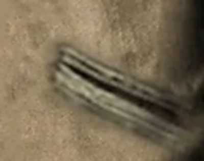
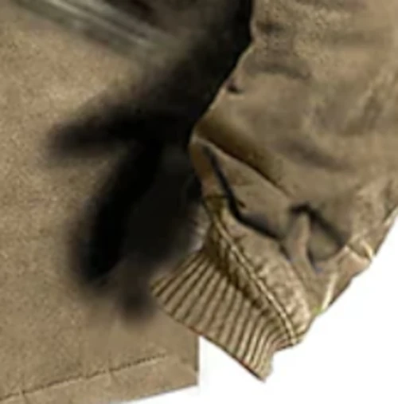

<h1> The Jacket </h1>

 An enigma. 

I've been a bit obsessed with this weird jacket I found online in an ad.  The pictures are from the store that sells the jacket. 
At a first glance it looks like a men's jacket. But the more you look at it, the more it looks... off somehow.

<figure>
  
  <figcaption>The Jacket</figcaption>
</figure>

 Ok, check it, let's zoom in on this thing. Can you see it? 

<figure>
  
  <figcaption>Details of the neck</figcaption>
</figure>

<figure>
  
  <figcaption>Details of the pocket</figcaption>
</figure>

 It's sort of like a video game model from the early 2000s, it has features, but they're weird and flat and blurry. This is where it gets really weird. Look at the shadow: 

<figure>
  
  <figcaption>Wait what, why does the shadow have fingers?</figcaption>
</figure>

<figure>
  
  <figcaption>What's going on with the zipper?</figcaption>
</figure>

HUH.

 It's available in different colors, too. Note how the smudges move around in the pictures. 

<figure>
  
  <figcaption>The Jacket in Gray</figcaption>
</figure>
<figure>
  
  <figcaption>The Jacket in Blue</figcaption>
</figure>
<figure>
  
  <figcaption>The Same Smudge, but also not...?</figcaption>
</figure>

I don't know what's going on. Either this the product images are outsourced on fiverr and this is like the laziest photoshop job ever, some form of malicious compliance, or someone is selling largely unsupervised stable diffusion-generated jackets. I have no idea what you get if you buy the thing but based on the amount of love and effort put into selling the thing, I don't expect much.

